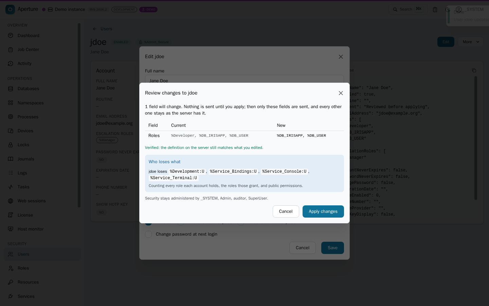
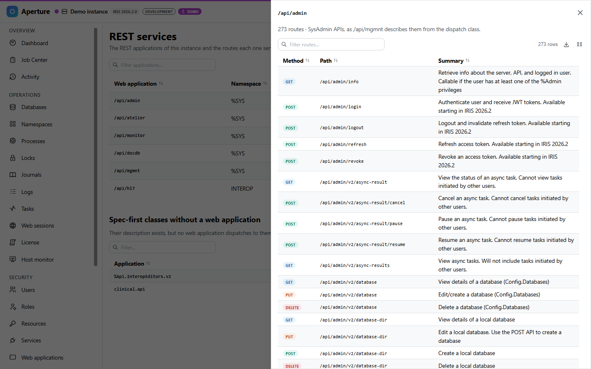
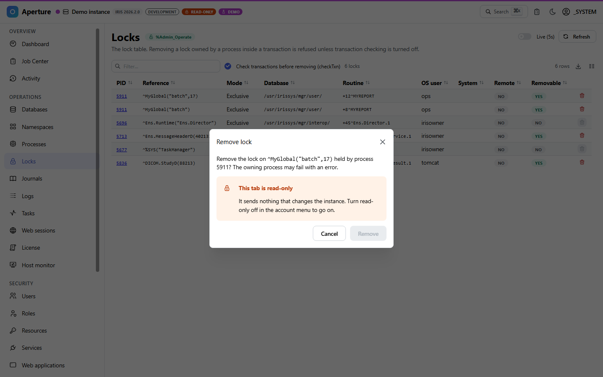
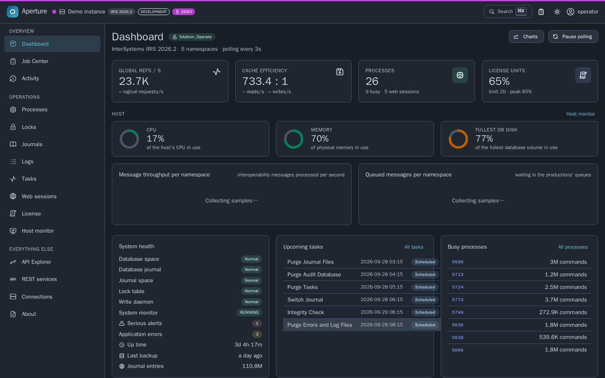
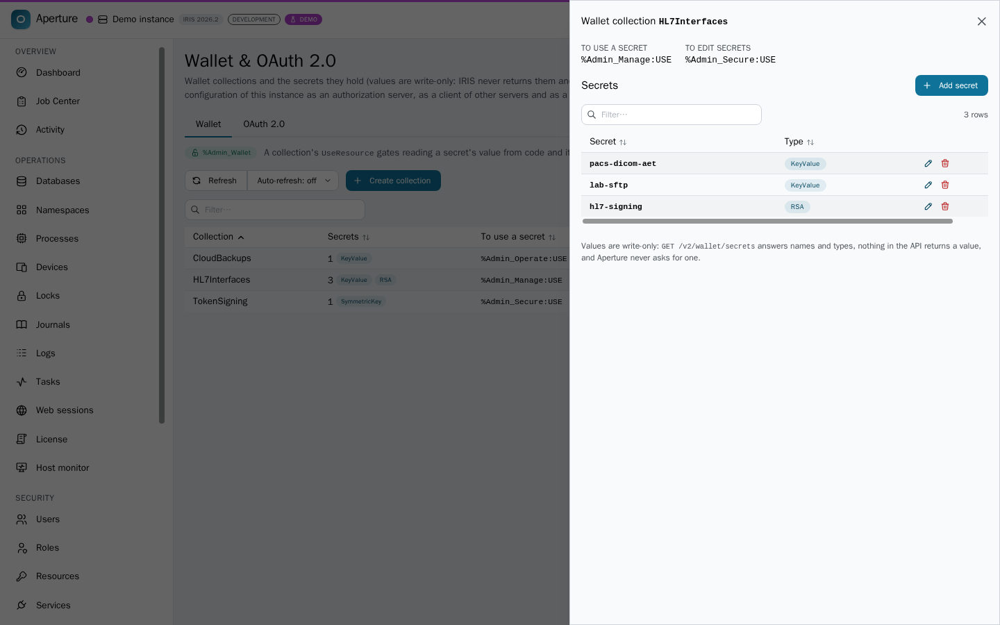
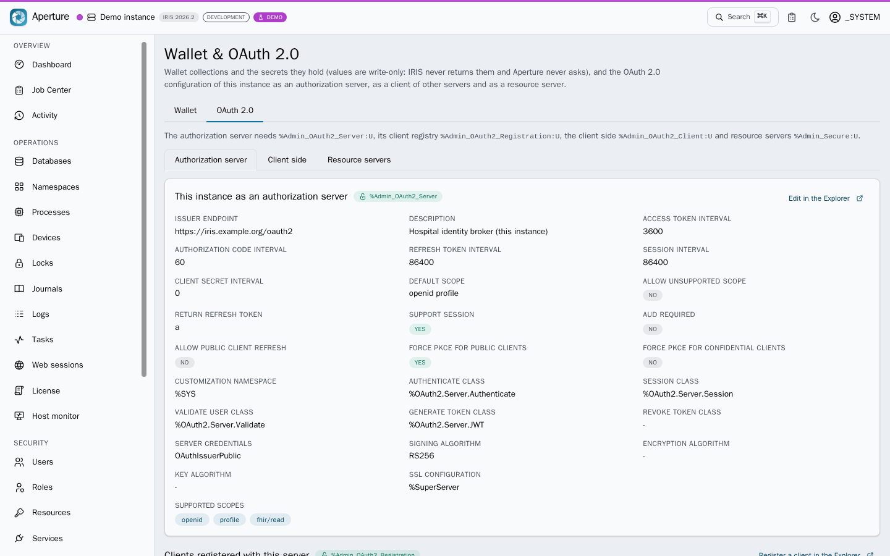
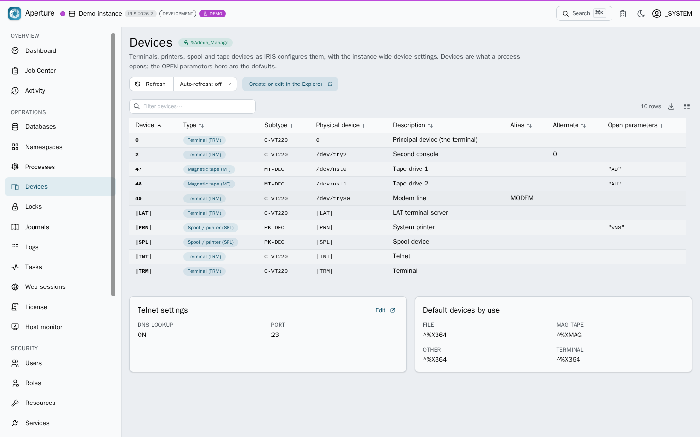
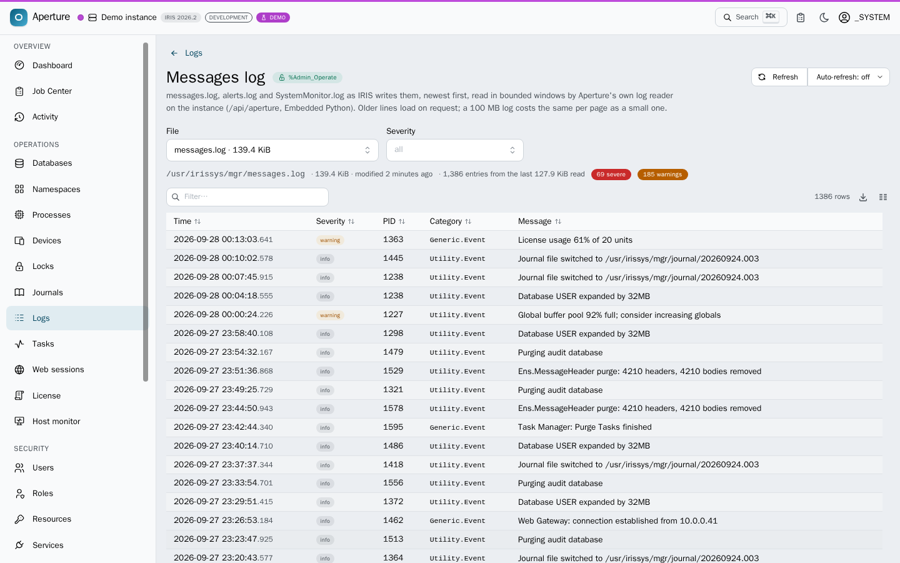
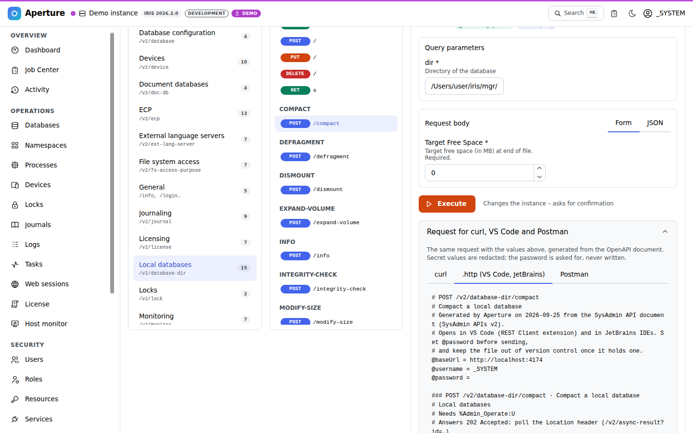

<p align="center">
  
</p>
<h1 align="center">Aperture</h1>
<p align="center"><b>A modern management portal for InterSystems IRIS, built entirely on the SysAdmin REST API.</b></p>
<p align="center">
  <a href="#online-demo">Online demo</a> ·
  <a href="#quick-start">Quick start</a> ·
  <a href="#what-you-get">Features</a> ·
  <a href="#architecture">Architecture</a> ·
  <a href="#spec-findings">Spec findings</a>
</p>

Aperture is an entry for the **InterSystems Programming Contest: Build Your Own Management Portal**.
It is a single-page application (React 19 + TypeScript) that talks only to the
[SysAdmin API v2](https://github.com/intersystems-community/sysadmin-api-specification) (`/api/admin`),
covers **all 273 operations** of the specification, and adds the things the classic portal never had:
a live dashboard, a Job Center for asynchronous operations, a command palette, privilege-aware
navigation, a guard against locking every administrator out, a "who loses what" preview of
permission changes, read-only tabs, discovery of every REST service on the instance, dark mode,
and an in-browser demo that needs no IRIS at all. For the one thing the API has no route for, the
instance's log files, the IPM package adds a small read-only reader of its own in Embedded Python
(`/api/aperture`), so `messages.log`, `alerts.log` and `SystemMonitor.log` are one screen too. It
was checked against real IRIS 2026.2 instances, and the 20 places where the specification and IRIS
disagree are listed below.


## Evaluate in two minutes

1. **Without an IRIS:** open the [online demo](https://mxsalata.github.io/aperture/) and press **Try the demo**. Press <kbd>⌘</kbd>/<kbd>Ctrl</kbd>+<kbd>K</kbd> and type `databases`, open `USER` and choose _Actions → Integrity check_: the `202 Accepted` lands in the Job Center with console output and progress. Open _Security → Users → jdoe_, remove a role and press Save: the review lists old → new and who loses which privilege. Open _Logs_ for every log in one place, _REST services_ for every REST route on the instance. Sign out and sign in as `operator` / `SYS`: the security area is gone and every disabled action names the resource it needs.
2. **Against a real IRIS (five minutes, Docker):** `npm run iris:password && docker compose up --build`, then http://localhost:8080 with `_SYSTEM` and the password in `.secrets/iris-password`. The build log ends with the readiness report of the Embedded Python installer; `npm run verify:live` re-checks the API contract against the running instance.
3. **In the code:** the fetch middleware that adds the token, refreshes it and captures every `202` ([`src/api/client.ts`](src/api/client.ts)); the guard that refuses a change leaving nobody able to administer security ([`src/features/security/adminGuard.ts`](src/features/security/adminGuard.ts)); the mock instance that powers the demo and both test suites ([`src/mocks`](src/mocks)); the Embedded Python installer and log reader ([`ipm/cls/Aperture`](ipm/cls/Aperture)).

## Online demo

**No IRIS required.** The demo build serves the entire SysAdmin API from a mock inside your browser
(Mock Service Worker), seeded to look like a busy IRIS 2026.2 instance with interoperability,
HL7/DICOM workloads, tasks, journals, users and audit history. Every write is real against the
in-memory instance: create a namespace, compact a database, terminate a process, purge audit records.

- Online: every CI run attaches the demo build as the `demo-site` artifact (download, unzip, serve the folder with any static server). The `deploy-demo` job publishes it to GitHub Pages once the repository is public and the repository variable `DEPLOY_DEMO` is set to `true`.
- Or locally: `npm run build:demo && npm run preview:demo` → http://localhost:4174

| Demo account | Password | Privileges                                        | What it shows                                              |
| ------------ | -------- | ------------------------------------------------- | ---------------------------------------------------------- |
| `_SYSTEM`    | `SYS`    | everything                                        | full portal                                                |
| `operator`   | `SYS`    | `%Admin_Operate`, `%Admin_Task`, `%Admin_Journal` | security screens disappear, actions explain what they need |
| `auditor`    | `SYS`    | `%Admin_Secure` only                              | only the security area is usable                           |

Every real deployment also has a **Try the demo** button on the login page.

## Quick start

### 1. Docker Compose (IRIS + portal, one command)

```bash
git clone https://github.com/MxSalata/aperture.git
cd aperture
npm run iris:password   # or write any password of 12+ characters to .secrets/iris-password
docker compose up --build
```

- http://localhost:8080 - Aperture behind nginx (proxies `/api/admin`, `/api/monitor`, `/api/mgmnt` and `/api/aperture` to IRIS: same origin, so no CORS and no Basic-auth pop-ups; sends a Content-Security-Policy). A second instance goes behind the same nginx under a path prefix (`/iris-b`, the pattern is documented in [`docker/nginx/default.conf.template`](docker/nginx/default.conf.template)) and gets a connection profile with that prefix as its base URL
- http://localhost:52773/aperture/index.html - Aperture served by IRIS itself (the committed `www/` build, refreshed with `npm run build:www`; the built-in web server needs the file name, a bare `/aperture/` answers 404)
- Sign in as `_SYSTEM` (or `SuperUser`) with the password in `.secrets/iris-password`. The image has no well-known password: the build sets it on every enabled account from that file, passed as a BuildKit secret, so it is in no image layer, build context or log. `CSPSystem`, the account the image's own Web Gateway signs in with, keeps its own password and holds no role.
- On a host with more than 20 CPU cores, IRIS Community stops at start-up with _Invalid Community Edition license, may have exceeded core limit_ (reported by the IRIS Atrium entry). Restrict the container's CPUs with a `docker-compose.override.yml` next to the compose file: `services: { iris: { cpuset: "0-19" } }`.
- The ports are published on `127.0.0.1` only by default. To use it from other machines, put TLS in front of nginx (it serves plain HTTP), then start with `APERTURE_BIND=0.0.0.0 docker compose up`.

The `iris` service is built from [`docker/iris/Dockerfile`](docker/iris/Dockerfile) on top of
`intersystems/iris-community:2026.2`, pinned by digest (`sha256:cd2ebcab…50bdaa`, Build 221U).
IRIS for Health Community 2026.2 is tested too, against a real instance
([evidence](docs/verification/2026-09-23-irishealth-2026.2/)): put
`IRIS_IMAGE=containers.intersystems.com/intersystems/irishealth-community:2026.2@sha256:7c06b6b3d950bc25f3e353b0a65db0c4045f251fb9103eade63514302b662cf3`
in a `.env` file next to the compose file. The portal image pins `node:22-alpine` and
`nginx:1.30-alpine` by digest, and CI pins every GitHub Action to a commit. At build time
[`docker/iris/init.script`](docker/iris/init.script) fetches the InterSystems Package Manager from the
community registry (installer 0.10.9, checked against its SHA-256) and installs Aperture through its own IPM package (`zpm "load"` of [`module.xml`](module.xml)): the built portal is copied into the instance's manager
directory (`mgr/aperture/`), the `/aperture` web application is created, the `/api/aperture` log reader
([`Aperture.API`](ipm/cls/Aperture/API.cls) over [`Aperture.Logs`](ipm/cls/Aperture/Logs.cls), Embedded Python)
is created, and [`Aperture.Installer`](ipm/cls/Aperture/Installer.cls), also Embedded Python, enables
`/api/admin` with password + JWT authentication. The build log ends with the installer's readiness
report; you can print it again at any time:

```bash
docker exec aperture-iris iris session IRIS -U USER "##class(Aperture.Installer).Doctor()"
```

### 2. IPM (ZPM) package

```objectscript
zpm "install iris-aperture"
```

copies the pre-built portal (`www/`) into the instance's manager directory (`mgr/aperture/`, which
durable %SYS keeps across container updates), creates the `/aperture`
web application and the `/api/aperture` log reader (a read-only `%CSP.REST` class over an Embedded
Python file reader, needs `%Admin_Operate:USE`), and runs [`Aperture.Installer`](ipm/cls/Aperture/Installer.cls),
an Embedded Python class that enables `/api/admin` with password and JWT authentication and prints a
readiness report (IRIS version, JWT availability, the API's authentication settings, the portal's
files, the log reader and the log files it can read). Then open
`http://<host>:52773/aperture/index.html`. From a checkout, `zpm "load /path/to/aperture"`
installs the same package; `##class(Aperture.Installer).Doctor()` prints the report again.

### 3. Development

```bash
npm install
cp .env.example .env           # VITE_IRIS_URL=http://localhost:52773
npm run dev                    # http://localhost:5173, /api/admin proxied to IRIS
```

Other scripts:

| Script                | What it does                                                                                                                  |
| --------------------- | ----------------------------------------------------------------------------------------------------------------------------- |
| `npm run build`       | type-check + production build (`dist/`, browser routing, for nginx)                                                           |
| `npm run build:www`   | build for IRIS-hosted deployment (`www/`, relative URLs + hash routing)                                                       |
| `npm run build:demo`  | build the online demo (`dist-demo/`, in-browser mock)                                                                         |
| `npm test`            | Vitest unit tests (client, auth, privileges, async jobs, spec index)                                                          |
| `npm run test:e2e`    | Playwright end-to-end tests against the demo build, with axe-core WCAG 2.1 AA audits                                          |
| `npm run smoke`       | walks the main screens in headless Chromium and refreshes `docs/screenshots/`                                                 |
| `npm run verify:live` | conformance check of a real instance (`IRIS_URL`, `IRIS_USER`, `IRIS_PASSWORD`), the log reader included, saves JSON evidence |
| `npm run gen:api`     | regenerate `src/api/schema.d.ts` and the operation index from `spec/mainspec_v2.json`                                         |

### Requirements on the IRIS side

- IRIS or IRIS for Health **2026.2+** with the `/api/admin` web application. Aperture speaks SysAdmin API v2, which ships with 2026.2; IRIS 2026.1 serves only v1 (every `/v2` path answers 404) and older releases have no SysAdmin API, so sign-in there stops with an explanation. Sign-in uses JWT and falls back to HTTP Basic when `/login` is unavailable (for example with JWT authentication switched off on `/api/admin`).
- The account needs at least one `%Admin_*` privilege (`GET /info` refuses everyone else).
- _Logs → Messages log_ reads the log files through the package's own `/api/aperture` web application (created by `zpm "install"`, `zpm "load"` and the Docker image; password authentication, `%Admin_Operate:USE`). On an instance without the package that screen says so and everything else works.
- The portal must be served from the same origin as the API it talks to: `/api/admin/v2` sends no CORS headers, by design (InterSystems, in the contest announcement thread, 22 September 2026), so a browser cannot call it across origins whatever the web application's allow-list says. The three supported topologies are all same-origin: nginx in front of IRIS (compose), the `/aperture` web application served by IRIS itself (IPM), and the Vite dev server's proxy. Further instances go behind the same nginx under a path prefix.

## The six contest areas

| Contest area                   | Where in Aperture                                                                                                                                                                                                                                                                                                                                                                                                                                            | Boundary                                                                                                                                                                                                                          |
| ------------------------------ | ------------------------------------------------------------------------------------------------------------------------------------------------------------------------------------------------------------------------------------------------------------------------------------------------------------------------------------------------------------------------------------------------------------------------------------------------------------ | --------------------------------------------------------------------------------------------------------------------------------------------------------------------------------------------------------------------------------- |
| Web applications and REST APIs | Security → Web applications (list, detail, JWT and CORS settings, create, edit, delete); every `/v2/web-app*` operation in the API Explorer; REST services (every REST application and its routes, from `/api/mgmnt`; the routes export as a Postman collection or a `.http` file, any route copies as curl: Ideas Portal DPI-I-813)                                                                                                                         | `/api/mgmnt` takes a password only, so a JWT session asks for it once (kept in the tab's memory); routes are what the dispatch class declares                                                                                     |
| Permission management          | Users, Roles, Resources, Services, SQL privileges; escalation-role login; every edit reviewed field by field against a fresh read; a change that would leave nobody able to administer security is refused, and one to a role says who loses what                                                                                                                                                                                                            | the portal adds no privilege of its own: what the account cannot do stays visible and disabled, with the resource it needs                                                                                                        |
| Security and secrets           | TLS & certificates (configurations with a connection test, X.509 credentials with certificate expiry); Wallet & OAuth 2.0 (collections with their use and edit resources, write-only secrets with usage, allowed hosts and TLS; the authorization server and its clients, the servers this instance is a client of with their client configurations, resource servers); audit settings; LDAP, MFT, encryption and the remaining OAuth writes in the Explorer | passwords, secrets, tokens and private keys are redacted before they are rendered, copied or exported; wallet secret values are never fetched                                                                                     |
| Task management                | Tasks (schedules, run now or at a time, suspend and resume, history), the task manager daemon, upcoming runs                                                                                                                                                                                                                                                                                                                                                 | the task is re-read after every change and the page says when IRIS reports something else                                                                                                                                         |
| OS management                  | Dashboard, Host monitor (CPU, memory, disk from `/api/monitor`), Processes, Devices (with the telnet and default-device settings), Locks, Databases, Namespaces, Journals, License, Web sessions; ECP, external language servers and file-system access through the Explorer                                                                                                                                                                                 | host measurements come from the native monitor service, not from the SysAdmin API                                                                                                                                                 |
| The logs                       | Logs hub → `messages.log`, `alerts.log` and `SystemMonitor.log` with their rotations (any `messages.old_*` file selectable, Ideas Portal DPI-I-966; newest first, older windows on request, severity filter), the audit log (asynchronous query, events, purge), journal records, task history, this tab's changes; a security change can be matched to the audit record that proves it                                                                      | the log files have no route in the SysAdmin API: they are read by the package's own read-only reader (`/api/aperture`, Embedded Python) in bounded windows, never whole; `^ERRORS` and SQL diagnostics stay in the classic portal |

## Ideas Portal ideas Aperture implements

Two ideas with the "Community Opportunity" status on the [InterSystems Ideas Portal](https://ideas.intersystems.com) are implemented here; each is one screen away in the demo.

| Idea                                                                                                                  | What it asks                                                                                                                                                                                        | Where Aperture does it                                                                                                                                                                                                                                                                                                                                                                                                                                                                                                                                                                                                                                                                                                |
| --------------------------------------------------------------------------------------------------------------------- | --------------------------------------------------------------------------------------------------------------------------------------------------------------------------------------------------- | --------------------------------------------------------------------------------------------------------------------------------------------------------------------------------------------------------------------------------------------------------------------------------------------------------------------------------------------------------------------------------------------------------------------------------------------------------------------------------------------------------------------------------------------------------------------------------------------------------------------------------------------------------------------------------------------------------------------- |
| [DPI-I-966 Option to show older message.log in IRIS SMP](https://ideas.intersystems.com/ideas/DPI-I-966)              | "It would be nice that we could choose in SMP portal to display any `messages.old_*` file": today it takes a remote desktop session to the server                                                   | Logs → Messages log. The package's log reader (`/api/aperture`, Embedded Python) catalogues `messages.log`, `alerts.log`, `SystemMonitor.log` and every rotation IRIS or an administrator leaves beside them (`messages.old_20260412_1`, `messages.log.1`, `messages_20260412.log`), newest first. The File selector lists them under their kind, and a rotation reads exactly like the current file: windows of whole lines, newest first, older on request, the same severity filter. Verified on IRIS Community 2026.2 in CI (`verify-iris`).                                                                                                                                                                      |
| [DPI-I-813 Make REST API Debugger for VSCode Recognise Open API Spec](https://ideas.intersystems.com/ideas/DPI-I-813) | Requests should come from the OpenAPI description instead of being typed field by field, and be importable into Postman. The idea is written for the VS Code ObjectScript extension's REST debugger | Done in the portal, and handed to VS Code and Postman as files. Every REST application's routes (REST services → Export) and every SysAdmin API operation (API Explorer → Export, and "Request for curl, VS Code and Postman" under each operation) are generated as ready requests: method, path, path and query parameters with their types, examples and required flags, an example body from the schema, the privileges needed. Saved as a Postman collection (format v2.1, one folder per group, Basic auth from variables), as a `.http` file the VS Code REST Client extension and JetBrains IDEs run, or copied as curl. The password is never written into a file, and secret values in a body are redacted. |

## What you get

| Area                                                       | Screens                                                                                                                                                                                                                                                                                                                        | Notable                                                                                       |
| ---------------------------------------------------------- | ------------------------------------------------------------------------------------------------------------------------------------------------------------------------------------------------------------------------------------------------------------------------------------------------------------------------------ | --------------------------------------------------------------------------------------------- |
| **Dashboard**                                              | live stats, sparklines, global refs/s and disk I/O charts, health, alerts, upcoming tasks, busy processes, resource seizes                                                                                                                                                                                                     | polls `/v2/monitor/*` every 3 s, keeps history while you navigate                             |
| **Job Center**                                             | every `202 Accepted` response, with console output, progress, pause / resume / cancel                                                                                                                                                                                                                                          | fed automatically by the API client (Location header or body GUID); toasts on completion      |
| **Activity**                                               | every change this tab sent and what the server answered, exportable as JSON; a security write can be matched to the `%System/%Security/*` audit record that proves it                                                                                                                                                          | recorded by the client middleware; audit lookup runs as an async task around the request time |
| **Host monitor**                                           | CPU, memory, disk, licence and alerts.log from the native `/api/monitor` service                                                                                                                                                                                                                                               | OpenMetrics parsed in the browser; degrades to "unavailable" honestly                         |
| **Databases**                                              | configuration + local file view, metrics (async), mount/dismount, compact, defragment, integrity check, truncate, expand, volumes, create, delete                                                                                                                                                                              | dangerous actions require typing the name                                                     |
| **Namespaces**                                             | create, delete, enable interoperability, copy mappings, global/package/routine mappings                                                                                                                                                                                                                                        |                                                                                               |
| **Processes**                                              | live list, detail with variables and roles, suspend/resume/terminate, broadcast                                                                                                                                                                                                                                                |                                                                                               |
| **Locks, Devices, Journals, Tasks, Web sessions, License** | lock removal with transaction check, devices with the telnet and default-device settings, journal files/records/settings/switching, task schedules + history + task manager (state re-read after every change), session ending, license key/usage/servers                                                                      |                                                                                               |
| **Logs**                                                   | a hub over every log of the instance, and a Messages log screen: `messages.log`, `alerts.log`, `SystemMonitor.log` and their rotations read in bounded windows through the package's `/api/aperture` reader, newest first, older on request, severity filter, the raw line of every entry                                      | `ipm/cls/Aperture/API.cls`, `Logs.cls` (Embedded Python), `src/lib/messagesLog.ts`            |
| **Security**                                               | users, roles, resources, services, web applications (JWT, CORS), audit events + log + purge, TLS/SSL configs + test, X.509 credentials with certificate expiry, wallet collections and write-only secrets, OAuth 2.0 in its three roles, SQL privileges                                                                        | secrets are redacted at the render boundary                                                   |
| **Permission safety**                                      | a change to a user or a role that would leave no enabled account holding %All or %Admin_Secure:U is refused; every such change lists, per account it reaches, the privileges lost and gained, counting granted roles and public permissions                                                                                    | `features/security/adminGuard.ts`, `impact.ts`                                                |
| **REST services**                                          | every REST web application of the instance, the spec-first classes no application serves, and the routes each one declares with what each takes, from `/api/mgmnt` (outside the SysAdmin API); the routes export as a Postman collection or a `.http` file, any route copies as curl                                           | a JWT session gives the password once, kept in the tab's memory only                          |
| **API Explorer**                                           | every one of the 273 operations rendered from the OpenAPI document: parameters, request body form or JSON, privileges, documented responses, response as table / fields / JSON; each operation also as curl, a `.http` block or a Postman item with the values typed, and the whole API or a group as a file                   | reachable from the command palette                                                            |
| **Everywhere**                                             | ⌘K command palette, privilege badges, raw JSON of every response with passwords, secrets, tokens and private keys redacted (and a count of what was hidden), responsive layout, multiple saved connections, escalation-role login, LIVE / OFFLINE / DEMO indicator, read-only tabs that send nothing that changes the instance | `src/lib/redact.ts`                                                                           |
| **Tables**                                                 | filter, sort and page live in the URL (share a link to exactly what you see; Back restores it), column choices and page size are remembered per table, every table exports its filtered rows as CSV, "no rows" and "nothing matches your filter" are different messages                                                        | `stateKey` / `exportName` on `DataTable`                                                      |
| **Instances**                                              | each saved connection has a colour (a bar under the header, so production never looks like staging) and an optional time zone, browser-tab titles carry the instance name and its LIVE flag, and an account without `%Admin_Operate` lands on a screen it can use                                                              | `docs/ARCHITECTURE.md` §2.10 for the time policy                                              |
| **Appearance**                                             | light, pastel (pale blue), dark or system theme plus an independent contrast axis (system / normal / high), applied before the first paint; live regions, keyboard-reachable tooltips, reduced-motion and forced-colors support; colour tokens and chart palettes tested for WCAG 2 AA contrast                                | Appearance menu; axe-core audits all five modes in CI                                         |
| **Change review**                                          | every edit form shows old → new per field, re-reads the object to detect concurrent edits, and only then applies; where IRIS merges a PUT, only the changed fields are sent                                                                                                                                                    | `reviewChanges()` in `src/components/ReviewChanges.tsx`                                       |

<details>
<summary>More screenshots</summary>

|                                                           |                                                             |
| --------------------------------------------------------- | ----------------------------------------------------------- |
|            |  |
|          |              |
|                    |                |
|                 |      |
|                  |             |
|      |                        |
|  |             |
|  |      |
|        |                |
|                  |                  |
|                |        |
|  |                                                             |

</details>

## Architecture

```
browser ──HTTP(S)─▶ nginx (dist/) ──/api/admin──▶ IRIS private web server / web gateway
                   (the container speaks HTTP; terminate TLS in front of it)
        or  ──▶ IRIS /aperture (www/, static CSP app, same origin)
        or  ──▶ Vite dev server (proxy)             or  ──▶ MSW mock (demo)
```

- **Typed client.** `openapi-typescript` turns `spec/mainspec_v2.json` into `src/api/schema.d.ts`;
  `openapi-fetch` gives compile-time checked paths, query parameters, bodies and responses for every operation.
- **Envelope handling.** `call()` / `result()` unwrap `{ status: { Errors, summary }, console, result }`
  and turn any non-2xx into an `ApiError` carrying the server's summary and console lines.
- **Authentication.** `POST /login` → JWT access + refresh tokens (IRIS 2026.2+). A fetch middleware adds
  the bearer header, refreshes proactively before expiry and once more on a 401, then retries the
  request with its original body. If `/login` does not exist, the client falls back to HTTP Basic.
  Escalation roles are supported via the `role` field of `/login`.
- **Asynchronous operations.** The same middleware watches for `202 Accepted`, parses the `Location`
  header (`/v2/async-result?id=…`) and registers a job. The Job Center polls until
  `Finished | Failed | Canceled`, shows `Console`, `Result` and `ProgressCurrent/ProgressTotal`, and
  invalidates cached queries when a job completes.
- **Privileges.** `GET /info` reports the user's `%Admin_*` permissions. Navigation, the command
  palette and every page header use them; unknown resources (older servers) stay optimistic.
- **Spec-driven Explorer.** A build step (`scripts/build-spec-index.mjs`) extracts a compact index
  (method, path, group, privileges, parameters, async flag); the full document is lazy-loaded only
  when the Explorer needs schemas to build forms and examples. The same index and schemas produce
  the requests other tools take: `src/lib/requestExport.ts` writes a Postman collection (format
  v2.1), a `.http` file or a curl command from any list of generated requests, whether they come
  from the SysAdmin document (`features/explorer/requests.ts`) or from a REST application's
  Swagger 2.0 (`api/mgmnt.ts`); the password stays in the browser and body secrets are redacted.
- **Log reader.** The SysAdmin API has no route for the instance's log files, so the IPM package adds
  one of its own: `/api/aperture`, a read-only `%CSP.REST` class (`ipm/cls/Aperture/API.cls`) over an
  Embedded Python file reader (`Logs.cls`). It catalogues `messages.log` (wherever `ConsoleFile` puts
  it), `alerts.log`, `SystemMonitor.log` and their rotations, and answers windows of whole lines of
  at most 256 KiB ending at a byte offset, so a client pages backwards at constant cost whatever the
  file's size; a file is named by its catalogue id, never by a path, and every route needs
  `%Admin_Operate:USE`. The browser parses the lines (`src/lib/messagesLog.ts`); the mock serves
  generated files so the demo has them too.
- **Demo / tests.** The MSW handlers in `src/mocks` implement the API against an in-memory instance,
  including JWT issuance, privilege enforcement, 202 tasks with progress, and a spec-driven fallback
  for every operation without a hand-written handler. The same handlers run in the browser (demo)
  and in Node (Vitest, Playwright).

## Documentation

| File                                         | Purpose                                                                                                      |
| -------------------------------------------- | ------------------------------------------------------------------------------------------------------------ |
| [docs/ARCHITECTURE.md](docs/ARCHITECTURE.md) | how the layers fit: typed client, auth, async jobs, privileges, mock, deployment                             |
| [docs/VERIFICATION.md](docs/VERIFICATION.md) | the conformance check against a real instance, and how to run it against yours                               |
| [docs/verification/](docs/verification/)     | recorded answers of real IRIS 2026.2 instances, one folder per run, the evidence for the spec findings below |
| [CHANGELOG.md](CHANGELOG.md)                 | what changed, and why                                                                                        |

## Verified against real IRIS

The CI job `verify-iris` builds the IRIS image (IRIS Community 2026.2, Aperture installed through
`zpm "load"` of its `module.xml`, Embedded Python installer), starts it and runs `scripts/live-check.mjs`: JWT login and refresh, `/info`, list shapes, the error envelope and a full `202` round trip,
plus a check that the portal is served at `/aperture/index.html` (22/22 on IRIS 2026.2, Build 221U). Run the same against your own instance with
`npm run verify:live`; results are recorded in [docs/VERIFICATION.md](docs/VERIFICATION.md). A real IRIS for
Health 2026.2 instance was also walked screen by screen, as an administrator and as an operator,
from a browser in another time zone (`npm run test:live`, opt-in); its answers are the evidence in
[docs/verification/2026-09-23-irishealth-2026.2](docs/verification/2026-09-23-irishealth-2026.2/)
and the second oracle of the mock's contract test.

## Spec findings

Things noticed while implementing the whole specification (reported for the API team). The specification is
vendored at commit `f764aea427e5c0b1dd08a4c18a0457e0ff7b3b34` of
[intersystems-community/sysadmin-api-specification](https://github.com/intersystems-community/sysadmin-api-specification).

1. `LocalDatabaseList` is declared as an object, but `GET /v2/database-dirs` returns an array. Aperture accepts both.
2. The specification documents `GET /info` as returning the `Info` object without the standard `{status, console, result}` envelope; IRIS 2026.2 (Build 221U) wraps it like every other endpoint. Aperture accepts both.
3. `POST /v2/database-dir/integrity-check` takes its targets in the body (`Databases[]`) while its siblings (`compact`, `defragment`, …) use the `dir` query parameter.
4. `POST /v2/journal/switch-dir` documents no body, so the target directory can only be the configured alternate directory.
5. The `Location` header points at `/v1/async-result?id=…` (on 2026.2 as in the spec example) while the documented endpoint is `/v2/async-result`; the id works on both. Aperture only relies on the `id` query parameter, and falls back to the `GUID` in the body when the header is not exposed (2026.2 sends no GUID in the body).
6. Real instances have been observed to answer errors as `status.errors` (objects with a `code`) instead of the documented `status.Errors` strings, and IRIS 2026.2 accepts `ServerDefinition` where the spec names the OAuth client field `OAuth2ServerDefinition` (both reported in the IRIS Workbench verification record). Aperture normalizes the envelopes and adapts the field; see `src/lib/quirks.ts`.
7. Error text is localized by the server from the request's `Accept-Language`; a client that sends none gets the messages in Arabic (`خطأ #420: Namespace … does not exist`, observed in CI). Browsers always send the header, and Aperture shows the numeric `code` and `id` next to the text, which are stable.
8. Creating a resource with an empty `PublicPermission` was refused by IRIS 2026.2 although the spec allows it (reported in the iris-fieldwork verification record; quirk `resource-create-empty-public`).
9. `GET /v2/security/services` answers `Enabled` as a boolean and sends no `EnabledBoolean`; the spec declares `Enabled: string` plus `EnabledBoolean: boolean`. A client written to the spec shows every service as disabled (Aperture did, until checked against IRIS for Health 2026.2).
10. `GET /v2/processes` spells the executable field `EXEname`; the spec declares `EXEName`, so a column bound to the spec stays empty.
11. `SystemUsage.BusyProcesses` of `GET /v2/monitor/dashboard/main` always has ten rows `{ Process, Commands }`, padded with `{ Process: "", Commands: 0 }`; the spec declares `Process` as an integer and says nothing about the padding.
12. `POST /v2/journal/file/records` returns half the `maxRows` it is given (200 → 100 records, the default 1000 → 500); the records are the first ones, contiguous.
13. `GET /v2/task/upcoming` stops at 100 runs when `maxRows` is not given; the spec documents 1000 as the default for every list.
14. `GET /v2/databases` and `GET /v2/database-dirs` answer 403, with an empty error list, to an account holding `%Operator`, although the spec allows `%Admin_Operate:U`; `GET /v2/database-dir` (one directory) is readable with it. As `%Operator`, `GET /v2/security/ldap/configurations` answers 500 (`<INVALID OREF>` in `%Api.Admin.Util.ClassQuery`) instead of 403.
15. Reading an async task again after it ended (`GET /v2/async-result` or the `/v1` path of the `Location` header) logs a severity-2 alert, `ERROR #7846: WQM attach passed invalid token`, from `TryToKillQueue^%Api.Admin.Util.AsyncTask`. The answer is unchanged, but each re-read lands in `messages.log` and `/api/monitor/alerts` and sets `iris_system_state` to 1 (Warning): a polling client that reads a finished task twice makes the instance look degraded to every monitor.
16. JWT sessions (undocumented behaviour, IRIS 2026.2 defaults): access tokens live 60 s and refresh tokens 900 s; `POST /refresh` rotates both, and the previous access token stops working at once; presenting a refresh token that was already used answers 401 and revokes the whole session; `POST /logout` needs the access token in `Authorization` (the refresh token in the body alone gets 401) and revokes both tokens with or without a body.
17. Error texts are HTML-escaped inside the JSON (`ERROR #5002: ObjectScript error: &lt;INVALID OREF&gt;…`); a client rendering them as text must unescape them.
18. `GET /v2/security/sql-privileges` names the object and the action `Object` and `Action`; the spec (`SQLPrivilegeList`) says `Name` and `Privilege`. A client written to the spec shows empty columns and revokes the wrong privilege.
19. `POST /v2/security/oauth2/revoke` does not exist: IRIS 2026.2 serves the operation at `POST /v2/security/oauth2/server/revoke` (the documented path answers 404 to every method, the other 405 with `Allow: POST` to a GET). The routes `%Api.Admin` declares, as `/api/mgmnt` lists them, also have `HEAD` on the three SQL privilege paths, which the spec does not document. The Explorer sends the revoke to its real path.
20. With JWT authentication switched off on `/api/admin`, `POST /login` does not answer 404: IRIS asks for a password before the request reaches the API, so it is a bodiless 401 with `WWW-Authenticate: Basic`, whatever the body carries. A wrong password with JWT on is the same bodiless 401 with `WWW-Authenticate: Bearer`. A client that falls back to Basic only on 404 reports a wrong password to every user of such an instance (Aperture did); the header is the only difference, and proxies that hide it to keep the browser's login dialog away must pass it on. Observed on IRIS Community 2026.2 Build 221U, and on `/api/mgmnt`, whose JWT authentication is off by default.

## Tech stack

React 19 · TypeScript 5.9 · Vite 7 · Mantine 8 (+ charts, spotlight, notifications, modals) · TanStack Query 5 · TanStack Table 8 · React Router 7 · zustand · openapi-typescript / openapi-fetch · Mock Service Worker 2 · Vitest 4 · Playwright · nginx · IPM · ObjectScript (`%CSP.REST`) · Embedded Python (installer, log reader)

## License

MIT - see [LICENSE](LICENSE).
