<p align="center">
  
</p>
<h1 align="center">Aperture</h1>
<p align="center"><b>A modern management portal for InterSystems IRIS, built entirely on the SysAdmin REST API.</b></p>
<p align="center">
  <a href="#online-demo">Online demo</a> ·
  <a href="#quick-start">Quick start</a> ·
  <a href="#what-you-get">Features</a> ·
  <a href="#architecture">Architecture</a> ·
  <a href="docs/ARTICLE.md">Article</a>
</p>

Aperture is an entry for the **InterSystems Programming Contest: Build Your Own Management Portal**.
It is a single-page application (React 19 + TypeScript) that talks only to the
[SysAdmin API v2](https://github.com/intersystems-community/sysadmin-api-specification) (`/api/admin`),
covers **all 273 operations** of the specification, and adds the things the classic portal never had:
a live dashboard, a Job Center for asynchronous operations, a command palette, privilege-aware
navigation, dark mode, and an in-browser demo that needs no IRIS at all.

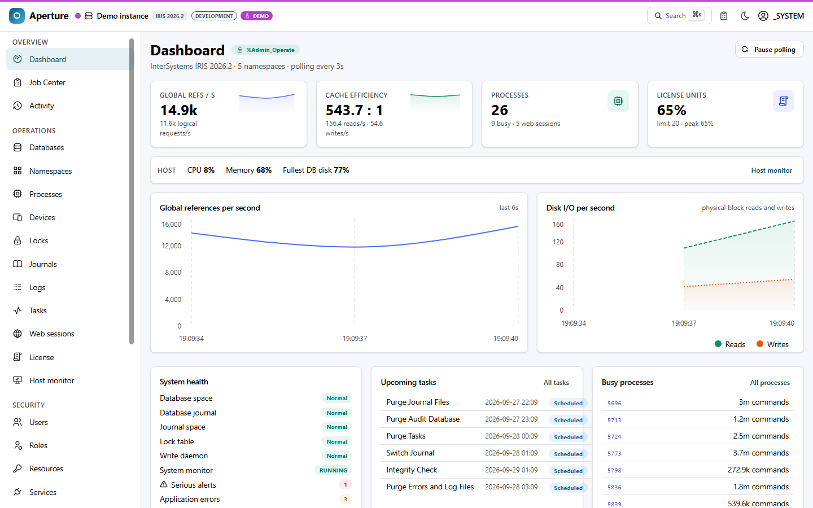

## Online demo

**No IRIS required.** The demo build serves the entire SysAdmin API from a mock inside your browser
(Mock Service Worker), seeded to look like a busy IRIS 2026.2 instance with interoperability,
HL7/DICOM workloads, tasks, journals, users and audit history. Every write is real against the
in-memory instance: create a namespace, compact a database, terminate a process, purge audit records.

- Online: every CI run attaches the demo build as the `demo-site` artifact (download, unzip, serve the folder with any static server). The `deploy-demo` job publishes it to GitHub Pages once the repository is public and the repository variable `DEPLOY_DEMO` is set to `true`.
- Or locally: `npm run build:demo && npm run preview:demo` → http://localhost:4174

| Demo account | Password | Privileges                                        | What it shows                                              |
| ------------ | -------- | ------------------------------------------------- | ---------------------------------------------------------- |
| `_SYSTEM`    | `SYS`    | everything                                        | full portal                                                |
| `operator`   | `SYS`    | `%Admin_Operate`, `%Admin_Task`, `%Admin_Journal` | security screens disappear, actions explain what they need |
| `auditor`    | `SYS`    | `%Admin_Secure` only                              | only the security area is usable                           |

Every real deployment also has a **Try the demo** button on the login page.

## Quick start

### 1. Docker Compose (IRIS + portal, one command)

```bash
git clone https://github.com/MxSalata/intersystems-frontend-contest.git
cd intersystems-frontend-contest
npm run iris:password   # or write any password of 12+ characters to .secrets/iris-password
docker compose up --build
```

- http://localhost:8080 - Aperture behind nginx (proxies `/api/admin` to IRIS, no CORS, no Basic-auth pop-ups; sends a Content-Security-Policy, set `IRIS_ALLOWED_ORIGINS="https://other.iris:52773"` on the `portal` service to let the browser call further instances directly)
- http://localhost:52773/aperture/index.html - Aperture served by IRIS itself (the committed `www/` build, refreshed with `npm run build:www`; the built-in web server needs the file name, a bare `/aperture/` answers 404)
- Sign in as `_SYSTEM` (or `SuperUser`) with the password in `.secrets/iris-password`. The image has no well-known password: the build sets it on every enabled account from that file, passed as a BuildKit secret, so it is in no image layer, build context or log. `CSPSystem`, the account the image's own Web Gateway signs in with, keeps its own password and holds no role.
- On a host with more than 20 CPU cores, IRIS Community stops at start-up with _Invalid Community Edition license, may have exceeded core limit_ (reported by the IRIS Atrium entry). Restrict the container's CPUs with a `docker-compose.override.yml` next to the compose file: `services: { iris: { cpuset: "0-19" } }`.
- The ports are published on `127.0.0.1` only by default. To use it from other machines, put TLS in front of nginx (it serves plain HTTP), then start with `APERTURE_BIND=0.0.0.0 docker compose up`.

The `iris` service is built from [`docker/iris/Dockerfile`](docker/iris/Dockerfile) on top of
`intersystems/iris-community:2026.2`, pinned by digest (`sha256:cd2ebcab…50bdaa`, Build 221U).
IRIS for Health Community 2026.2 is tested too, against a real instance
([evidence](docs/verification/2026-09-23-irishealth-2026.2/)): put
`IRIS_IMAGE=containers.intersystems.com/intersystems/irishealth-community:2026.2@sha256:7c06b6b3d950bc25f3e353b0a65db0c4045f251fb9103eade63514302b662cf3`
in a `.env` file next to the compose file. The portal image pins `node:22-alpine` and
`nginx:1.30-alpine` by digest, and CI pins every GitHub Action to a commit. At build time
[`docker/iris/init.script`](docker/iris/init.script) fetches the InterSystems Package Manager from the
community registry (installer 0.10.9, checked against its SHA-256) and installs Aperture through its own IPM package (`zpm "load"` of [`module.xml`](module.xml)): the built portal is copied under the instance's `csp/`
directory, the `/aperture` web application is created, and [`Aperture.Installer`](ipm/cls/Aperture/Installer.cls),
written in Embedded Python, enables `/api/admin` with password + JWT authentication. The build log
ends with the installer's readiness report; you can print it again at any time:

```bash
docker exec aperture-iris iris session IRIS -U USER "##class(Aperture.Installer).Doctor()"
```

### 2. IPM (ZPM) package

```objectscript
zpm "install iris-aperture"
```

copies the pre-built portal (`www/`) under the instance's `csp/` directory, creates the `/aperture`
web application and runs [`Aperture.Installer`](ipm/cls/Aperture/Installer.cls), an Embedded Python
class that enables `/api/admin` with password and JWT authentication and prints a readiness report
(IRIS version, JWT availability, the API's authentication settings, the portal's files). Then open
`http://<host>:52773/aperture/index.html`. From a checkout, `zpm "load /path/to/intersystems-frontend-contest"`
installs the same package; `##class(Aperture.Installer).Doctor()` prints the report again.

### 3. Development

```bash
npm install
cp .env.example .env           # VITE_IRIS_URL=http://localhost:52773
npm run dev                    # http://localhost:5173, /api/admin proxied to IRIS
```

Other scripts:

| Script                | What it does                                                                                         |
| --------------------- | ---------------------------------------------------------------------------------------------------- |
| `npm run build`       | type-check + production build (`dist/`, browser routing, for nginx)                                  |
| `npm run build:www`   | build for IRIS-hosted deployment (`www/`, relative URLs + hash routing)                              |
| `npm run build:demo`  | build the online demo (`dist-demo/`, in-browser mock)                                                |
| `npm test`            | Vitest unit tests (client, auth, privileges, async jobs, spec index)                                 |
| `npm run test:e2e`    | Playwright end-to-end tests against the demo build, with axe-core WCAG 2.1 AA audits                 |
| `npm run smoke`       | walks the main screens in headless Chromium and refreshes `docs/screenshots/`                        |
| `npm run verify:live` | conformance check of a real instance (`IRIS_URL`, `IRIS_USER`, `IRIS_PASSWORD`), saves JSON evidence |
| `npm run gen:api`     | regenerate `src/api/schema.d.ts` and the operation index from `spec/mainspec_v2.json`                |

### Requirements on the IRIS side

- IRIS or IRIS for Health **2026.2+** with the `/api/admin` web application. Aperture speaks SysAdmin API v2, which ships with 2026.2; IRIS 2026.1 serves only v1 (every `/v2` path answers 404) and older releases have no SysAdmin API, so sign-in there stops with an explanation. Sign-in uses JWT and falls back to HTTP Basic when `/login` is unavailable (for example with JWT authentication switched off on `/api/admin`).
- The account needs at least one `%Admin_*` privilege (`GET /info` refuses everyone else).
- If the portal is served from a different origin than IRIS, add that origin to the CORS allow-list of `/api/admin` (Aperture can do that itself under _Security → Web applications → /api/admin_).

## The six contest areas

| Contest area                   | Where in Aperture                                                                                                                                                                              | Boundary                                                                                                                                      |
| ------------------------------ | ---------------------------------------------------------------------------------------------------------------------------------------------------------------------------------------------- | --------------------------------------------------------------------------------------------------------------------------------------------- |
| Web applications and REST APIs | Security → Web applications (list, detail, JWT and CORS settings, create, edit, delete); every `/v2/web-app*` operation in the API Explorer                                                    | REST routes deployed inside an application are not discovered; that needs `/api/mgmnt`, outside the SysAdmin API                              |
| Permission management          | Users, Roles, Resources, Services, SQL privileges; escalation-role login; every edit reviewed field by field against a fresh read                                                              | the portal adds no privilege of its own: what the account cannot do stays visible and disabled, with the resource it needs                    |
| Security and secrets           | TLS & certificates (configurations with a connection test, X.509 credentials with certificate expiry), audit settings; wallet, OAuth 2.0, LDAP and X.509 operations in the Explorer            | passwords, secrets, tokens and private keys are redacted before they are rendered, copied or exported; wallet secret values are never fetched |
| Task management                | Tasks (schedules, run now or at a time, suspend and resume, history), the task manager daemon, upcoming runs                                                                                   | the task is re-read after every change and the page says when IRIS reports something else                                                     |
| OS management                  | Dashboard, Host monitor (CPU, memory, disk from `/api/monitor`), Processes, Locks, Databases, Namespaces, Journals, License, Web sessions; devices and ECP through the Explorer                | host measurements come from the native monitor service, not from the SysAdmin API                                                             |
| The logs                       | Logs hub → audit log (asynchronous query, events, purge), journal records, `alerts.log`, task history, this tab's changes; a security change can be matched to the audit record that proves it | `messages.log`, the application error log and SQL diagnostics have no API route and are not read                                              |

## What you get

| Area                                                    | Screens                                                                                                                                                                                                                                                                     | Notable                                                                                       |
| ------------------------------------------------------- | --------------------------------------------------------------------------------------------------------------------------------------------------------------------------------------------------------------------------------------------------------------------------- | --------------------------------------------------------------------------------------------- |
| **Dashboard**                                           | live stats, sparklines, global refs/s and disk I/O charts, health, alerts, upcoming tasks, busy processes, resource seizes                                                                                                                                                  | polls `/v2/monitor/*` every 3 s, keeps history while you navigate                             |
| **Job Center**                                          | every `202 Accepted` response, with console output, progress, pause / resume / cancel                                                                                                                                                                                       | fed automatically by the API client (Location header or body GUID); toasts on completion      |
| **Activity**                                            | every change this tab sent and what the server answered, exportable as JSON; a security write can be matched to the `%System/%Security/*` audit record that proves it                                                                                                       | recorded by the client middleware; audit lookup runs as an async task around the request time |
| **Host monitor**                                        | CPU, memory, disk, licence and alerts.log from the native `/api/monitor` service                                                                                                                                                                                            | OpenMetrics parsed in the browser; degrades to "unavailable" honestly                         |
| **Databases**                                           | configuration + local file view, metrics (async), mount/dismount, compact, defragment, integrity check, truncate, expand, volumes, create, delete                                                                                                                           | dangerous actions require typing the name                                                     |
| **Namespaces**                                          | create, delete, enable interoperability, copy mappings, global/package/routine mappings                                                                                                                                                                                     |                                                                                               |
| **Processes**                                           | live list, detail with variables and roles, suspend/resume/terminate, broadcast                                                                                                                                                                                             |                                                                                               |
| **Locks, Journals, Tasks, Web sessions, License, Logs** | lock removal with transaction check, journal files/records/settings/switching, task schedules + history + task manager (state re-read after every change), session ending, license key/usage/servers, a Logs hub over every log the API exposes                             |                                                                                               |
| **Security**                                            | users, roles, resources, services, web applications (JWT, CORS), audit events + log + purge, TLS/SSL configs + test, X.509 credentials with certificate expiry, SQL privileges                                                                                              | secrets are redacted at the render boundary                                                   |
| **API Explorer**                                        | every one of the 273 operations rendered from the OpenAPI document: parameters, request body form or JSON, privileges, documented responses, response as table / fields / JSON                                                                                              | reachable from the command palette                                                            |
| **Everywhere**                                          | ⌘K command palette, privilege badges, raw JSON of every response with passwords, secrets, tokens and private keys redacted (and a count of what was hidden), responsive layout, multiple saved connections, escalation-role login, LIVE / OFFLINE / DEMO indicator          | `src/lib/redact.ts`                                                                           |
| **Tables**                                              | filter, sort and page live in the URL (share a link to exactly what you see; Back restores it), column choices and page size are remembered per table, every table exports its filtered rows as CSV, "no rows" and "nothing matches your filter" are different messages     | `stateKey` / `exportName` on `DataTable`                                                      |
| **Instances**                                           | each saved connection has a colour (a bar under the header, so production never looks like staging) and an optional time zone, browser-tab titles carry the instance name and its LIVE flag, and an account without `%Admin_Operate` lands on a screen it can use           | `docs/ARCHITECTURE.md` §2.10 for the time policy                                              |
| **Appearance**                                          | light / dark / system theme plus an independent contrast axis (system / normal / high), applied before the first paint; live regions, keyboard-reachable tooltips, reduced-motion and forced-colors support; colour tokens and chart palettes tested for WCAG 2 AA contrast | Appearance menu; axe-core audits all four modes in CI                                         |
| **Change review**                                       | every edit form shows old → new per field, re-reads the object to detect concurrent edits, and only then applies                                                                                                                                                            | `reviewChanges()` in `src/components/ReviewChanges.tsx`                                       |

<details>
<summary>More screenshots</summary>

|                                                           |                                                             |
| --------------------------------------------------------- | ----------------------------------------------------------- |
| 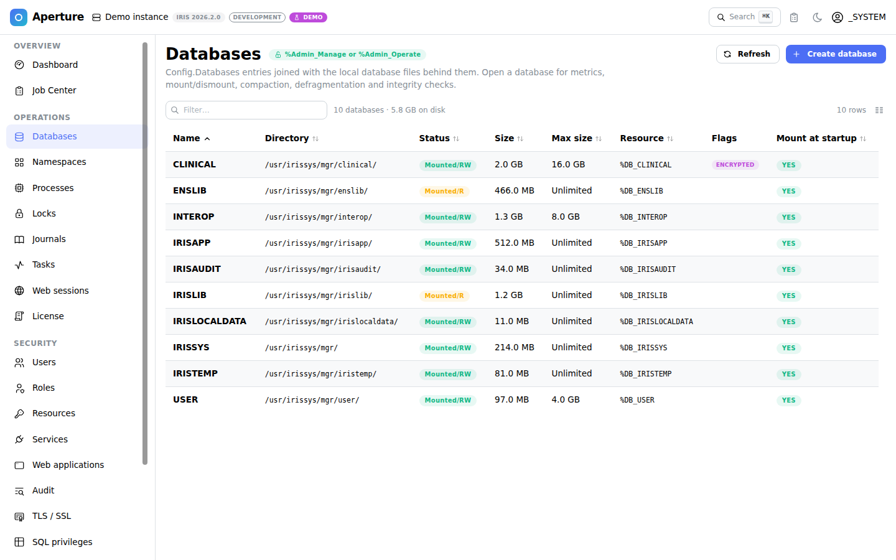           | 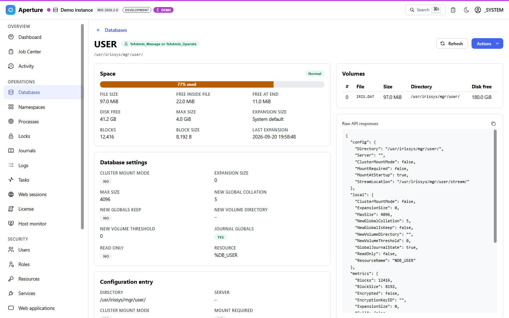 |
| 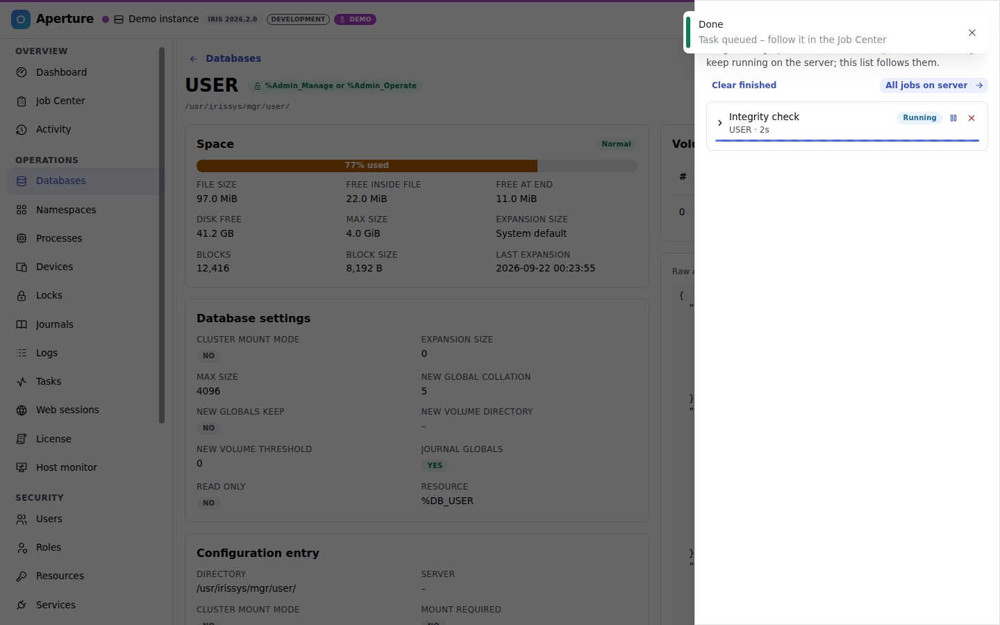         | 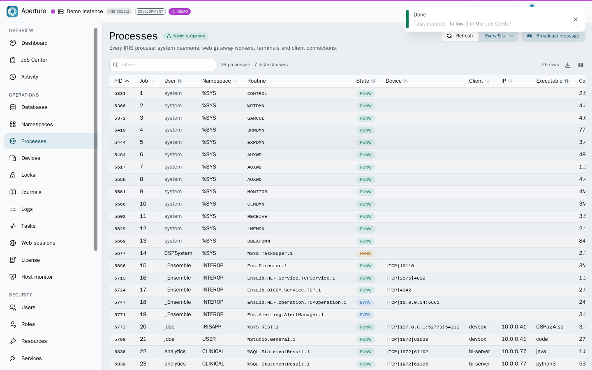             |
| 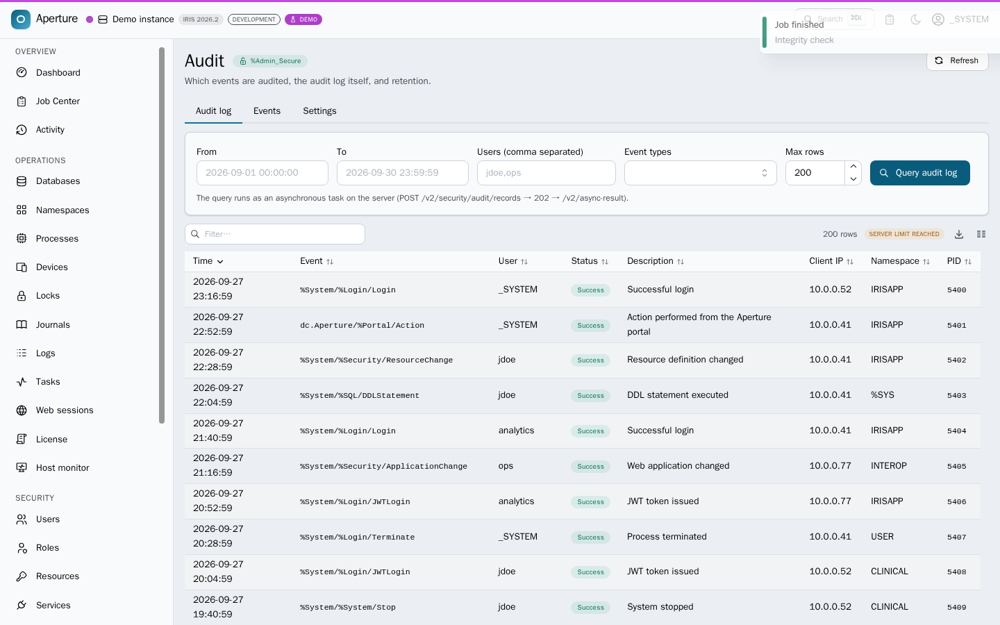                   | 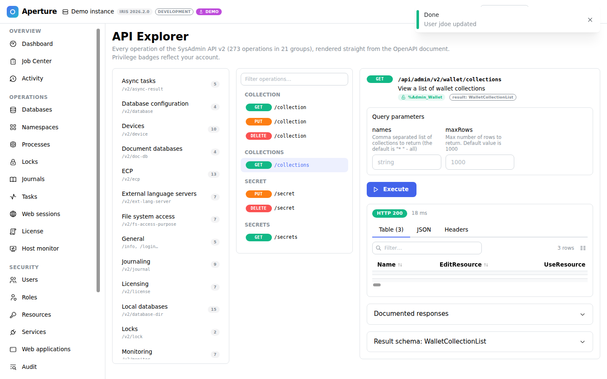               |
| 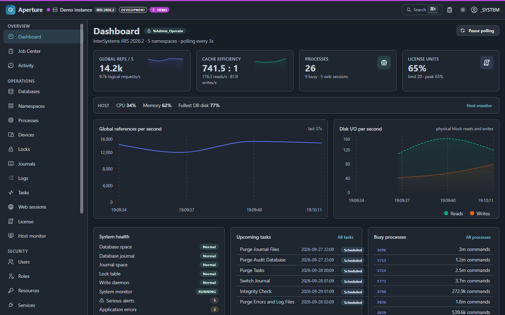                | 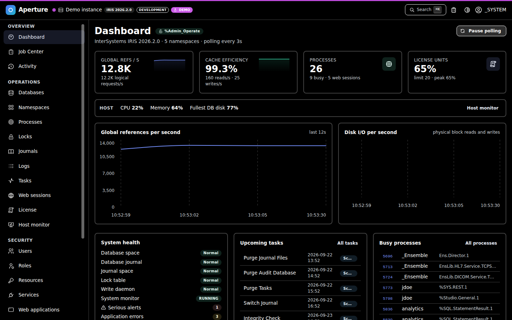     |
| 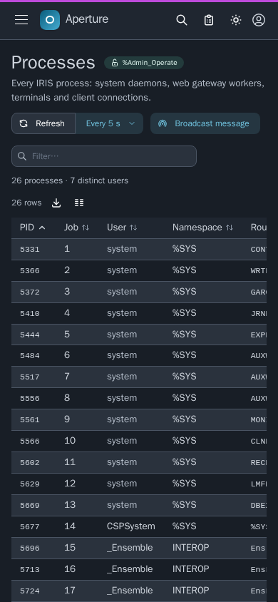                 | 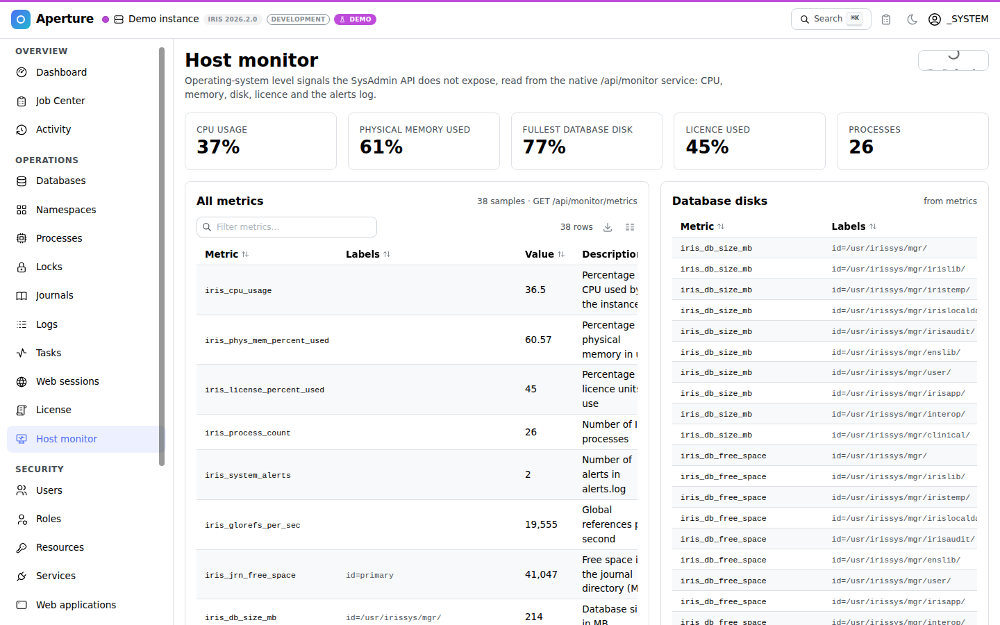            |
| 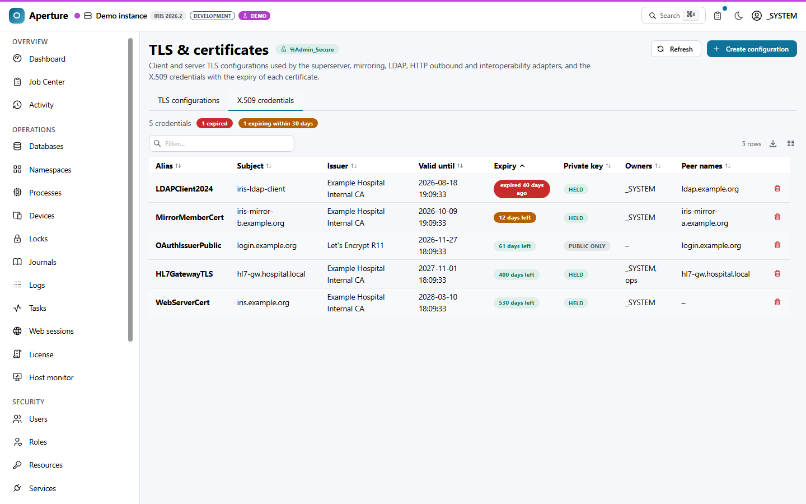     | 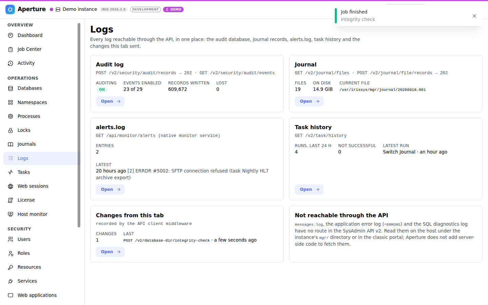                       |
| 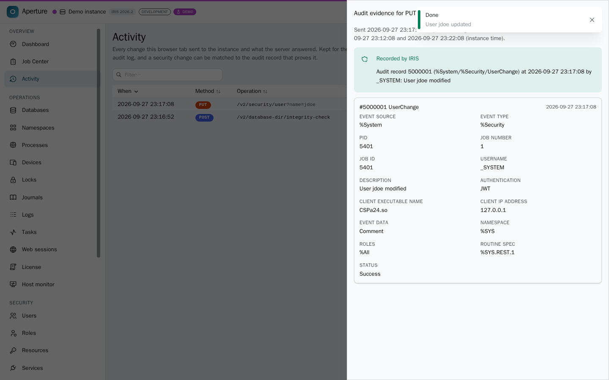 | 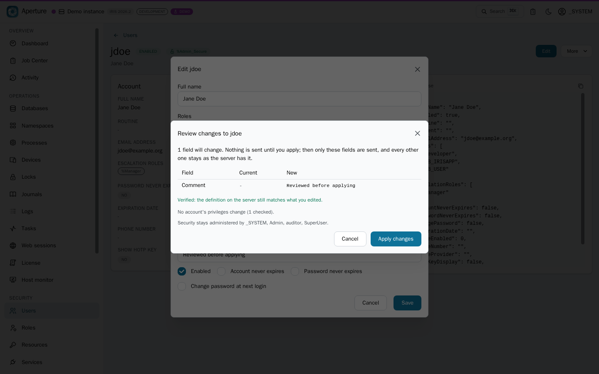            |

</details>

## Architecture

```
browser ──HTTP(S)─▶ nginx (dist/) ──/api/admin──▶ IRIS private web server / web gateway
                   (the container speaks HTTP; terminate TLS in front of it)
        or  ──▶ IRIS /aperture (www/, static CSP app, same origin)
        or  ──▶ Vite dev server (proxy)             or  ──▶ MSW mock (demo)
```

- **Typed client.** `openapi-typescript` turns `spec/mainspec_v2.json` into `src/api/schema.d.ts`;
  `openapi-fetch` gives compile-time checked paths, query parameters, bodies and responses for every operation.
- **Envelope handling.** `call()` / `result()` unwrap `{ status: { Errors, summary }, console, result }`
  and turn any non-2xx into an `ApiError` carrying the server's summary and console lines.
- **Authentication.** `POST /login` → JWT access + refresh tokens (IRIS 2026.2+). A fetch middleware adds
  the bearer header, refreshes proactively before expiry and once more on a 401, then retries the
  request with its original body. If `/login` does not exist, the client falls back to HTTP Basic.
  Escalation roles are supported via the `role` field of `/login`.
- **Asynchronous operations.** The same middleware watches for `202 Accepted`, parses the `Location`
  header (`/v2/async-result?id=…`) and registers a job. The Job Center polls until
  `Finished | Failed | Canceled`, shows `Console`, `Result` and `ProgressCurrent/ProgressTotal`, and
  invalidates cached queries when a job completes.
- **Privileges.** `GET /info` reports the user's `%Admin_*` permissions. Navigation, the command
  palette and every page header use them; unknown resources (older servers) stay optimistic.
- **Spec-driven Explorer.** A build step (`scripts/build-spec-index.mjs`) extracts a compact index
  (method, path, group, privileges, parameters, async flag); the full document is lazy-loaded only
  when the Explorer needs schemas to build forms and examples.
- **Demo / tests.** The MSW handlers in `src/mocks` implement the API against an in-memory instance,
  including JWT issuance, privilege enforcement, 202 tasks with progress, and a spec-driven fallback
  for every operation without a hand-written handler. The same handlers run in the browser (demo)
  and in Node (Vitest, Playwright).

## Documentation

| File                                                               | Purpose                                                                          |
| ------------------------------------------------------------------ | -------------------------------------------------------------------------------- |
| [docs/ARCHITECTURE.md](docs/ARCHITECTURE.md)                       | how the layers fit: typed client, auth, async jobs, privileges, mock, deployment |
| [docs/CONTEST_PLAN.md](docs/CONTEST_PLAN.md)                       | contest requirements, judging, bonuses, plan                                     |
| [docs/BONUSES.md](docs/BONUSES.md)                                 | technology bonuses: criteria, evidence, what remains                             |
| [docs/OPENEXCHANGE_SUBMISSION.md](docs/OPENEXCHANGE_SUBMISSION.md) | paste-ready Open Exchange listing                                                |
| [docs/SUBMISSION_CHECKLIST.md](docs/SUBMISSION_CHECKLIST.md)       | everything to tick before the deadline                                           |
| [docs/ARTICLE.md](docs/ARTICLE.md)                                 | Developer Community article draft                                                |
| [docs/ARTICLE_2.md](docs/ARTICLE_2.md)                             | second article draft: what the specification does not tell you                   |
| [docs/VIDEO_SCRIPT.md](docs/VIDEO_SCRIPT.md)                       | three demo video storyboards                                                     |

## Verified against real IRIS

The CI job `verify-iris` builds the IRIS image (IRIS Community 2026.2, Aperture installed through
`zpm "load"` of its `module.xml`, Embedded Python installer), starts it and runs `scripts/live-check.mjs`: JWT login and refresh, `/info`, list shapes, the error envelope and a full `202` round trip,
plus a check that the portal is served at `/aperture/index.html` (22/22 on IRIS 2026.2, Build 221U). Run the same against your own instance with
`npm run verify:live`; results are recorded in [docs/VERIFICATION.md](docs/VERIFICATION.md). A real IRIS for
Health 2026.2 instance was also walked screen by screen, as an administrator and as an operator,
from a browser in another time zone (`npm run test:live`, opt-in); its answers are the evidence in
[docs/verification/2026-09-23-irishealth-2026.2](docs/verification/2026-09-23-irishealth-2026.2/)
and the second oracle of the mock's contract test.

## Spec findings

Things noticed while implementing the whole specification (reported for the API team). The specification is
vendored at commit `f764aea427e5c0b1dd08a4c18a0457e0ff7b3b34` of
[intersystems-community/sysadmin-api-specification](https://github.com/intersystems-community/sysadmin-api-specification).

1. `LocalDatabaseList` is declared as an object, but `GET /v2/database-dirs` returns an array. Aperture accepts both.
2. The specification documents `GET /info` as returning the `Info` object without the standard `{status, console, result}` envelope; IRIS 2026.2 (Build 221U) wraps it like every other endpoint. Aperture accepts both.
3. `POST /v2/database-dir/integrity-check` takes its targets in the body (`Databases[]`) while its siblings (`compact`, `defragment`, …) use the `dir` query parameter.
4. `POST /v2/journal/switch-dir` documents no body, so the target directory can only be the configured alternate directory.
5. The `Location` header points at `/v1/async-result?id=…` (on 2026.2 as in the spec example) while the documented endpoint is `/v2/async-result`; the id works on both. Aperture only relies on the `id` query parameter, and falls back to the `GUID` in the body when the header is not exposed (2026.2 sends no GUID in the body).
6. Real instances have been observed to answer errors as `status.errors` (objects with a `code`) instead of the documented `status.Errors` strings, and IRIS 2026.2 accepts `ServerDefinition` where the spec names the OAuth client field `OAuth2ServerDefinition` (both reported in the IRIS Workbench verification record). Aperture normalizes the envelopes and adapts the field; see `src/lib/quirks.ts`.
7. Error text is localized by the server from the request's `Accept-Language`; a client that sends none gets the messages in Arabic (`خطأ #420: Namespace … does not exist`, observed in CI). Browsers always send the header, and Aperture shows the numeric `code` and `id` next to the text, which are stable.
8. Creating a resource with an empty `PublicPermission` was refused by IRIS 2026.2 although the spec allows it (reported in the iris-fieldwork verification record; quirk `resource-create-empty-public`).
9. `GET /v2/security/services` answers `Enabled` as a boolean and sends no `EnabledBoolean`; the spec declares `Enabled: string` plus `EnabledBoolean: boolean`. A client written to the spec shows every service as disabled (Aperture did, until checked against IRIS for Health 2026.2).
10. `GET /v2/processes` spells the executable field `EXEname`; the spec declares `EXEName`, so a column bound to the spec stays empty.
11. `SystemUsage.BusyProcesses` of `GET /v2/monitor/dashboard/main` always has ten rows `{ Process, Commands }`, padded with `{ Process: "", Commands: 0 }`; the spec declares `Process` as an integer and says nothing about the padding.
12. `POST /v2/journal/file/records` returns half the `maxRows` it is given (200 → 100 records, the default 1000 → 500); the records are the first ones, contiguous.
13. `GET /v2/task/upcoming` stops at 100 runs when `maxRows` is not given; the spec documents 1000 as the default for every list.
14. `GET /v2/databases` and `GET /v2/database-dirs` answer 403, with an empty error list, to an account holding `%Operator`, although the spec allows `%Admin_Operate:U`; `GET /v2/database-dir` (one directory) is readable with it. As `%Operator`, `GET /v2/security/ldap/configurations` answers 500 (`<INVALID OREF>` in `%Api.Admin.Util.ClassQuery`) instead of 403.
15. Reading an async task again after it ended (`GET /v2/async-result` or the `/v1` path of the `Location` header) logs a severity-2 alert, `ERROR #7846: WQM attach passed invalid token`, from `TryToKillQueue^%Api.Admin.Util.AsyncTask`. The answer is unchanged, but each re-read lands in `messages.log` and `/api/monitor/alerts` and sets `iris_system_state` to 1 (Warning): a polling client that reads a finished task twice makes the instance look degraded to every monitor.
16. JWT sessions (undocumented behaviour, IRIS 2026.2 defaults): access tokens live 60 s and refresh tokens 900 s; `POST /refresh` rotates both, and the previous access token stops working at once; presenting a refresh token that was already used answers 401 and revokes the whole session; `POST /logout` needs the access token in `Authorization` (the refresh token in the body alone gets 401) and revokes both tokens with or without a body.
17. Error texts are HTML-escaped inside the JSON (`ERROR #5002: ObjectScript error: &lt;INVALID OREF&gt;…`); a client rendering them as text must unescape them.
18. `GET /v2/security/sql-privileges` names the object and the action `Object` and `Action`; the spec (`SQLPrivilegeList`) says `Name` and `Privilege`. A client written to the spec shows empty columns and revokes the wrong privilege.

## Tech stack

React 19 · TypeScript 5.9 · Vite 7 · Mantine 8 (+ charts, spotlight, notifications, modals) · TanStack Query 5 · TanStack Table 8 · React Router 7 · zustand · openapi-typescript / openapi-fetch · Mock Service Worker 2 · Vitest 3 · Playwright · nginx · IPM · Embedded Python (installer)

## License

MIT - see [LICENSE](LICENSE).
