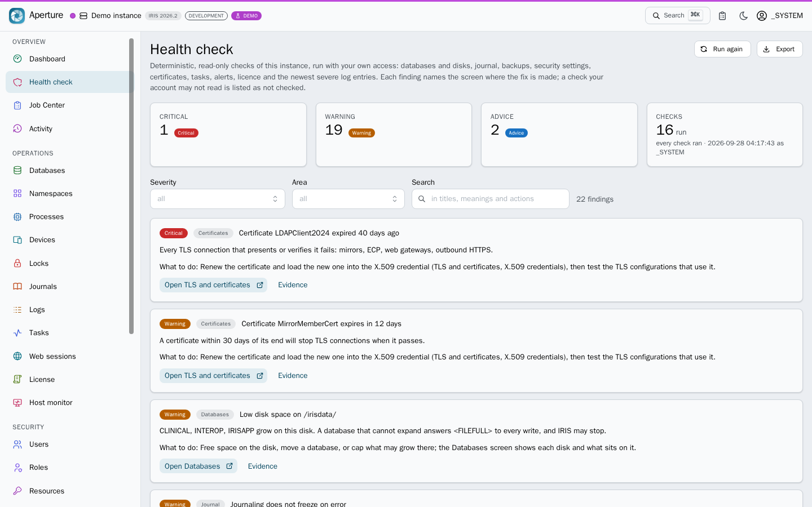
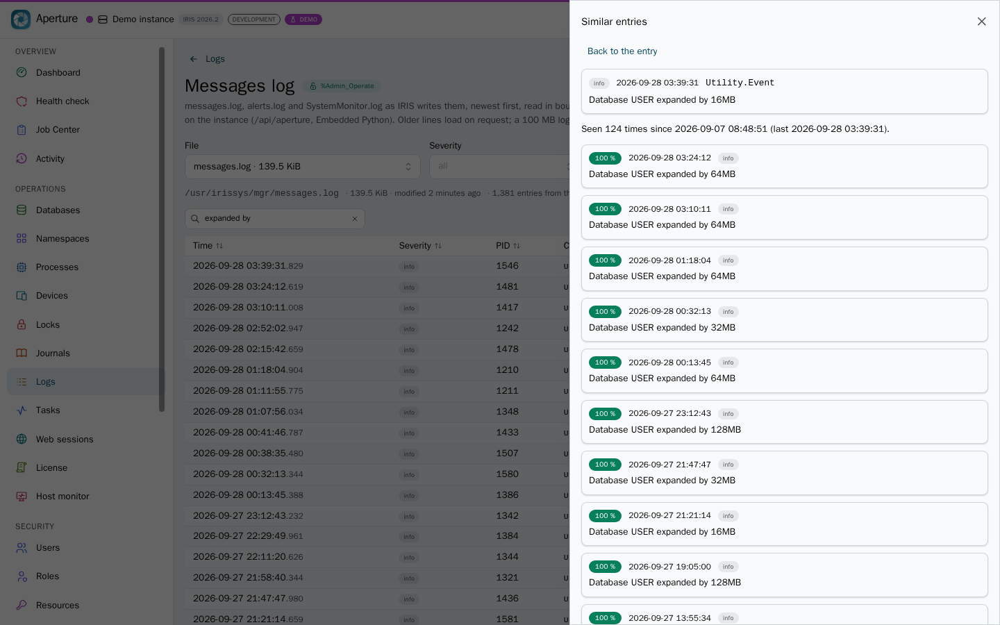
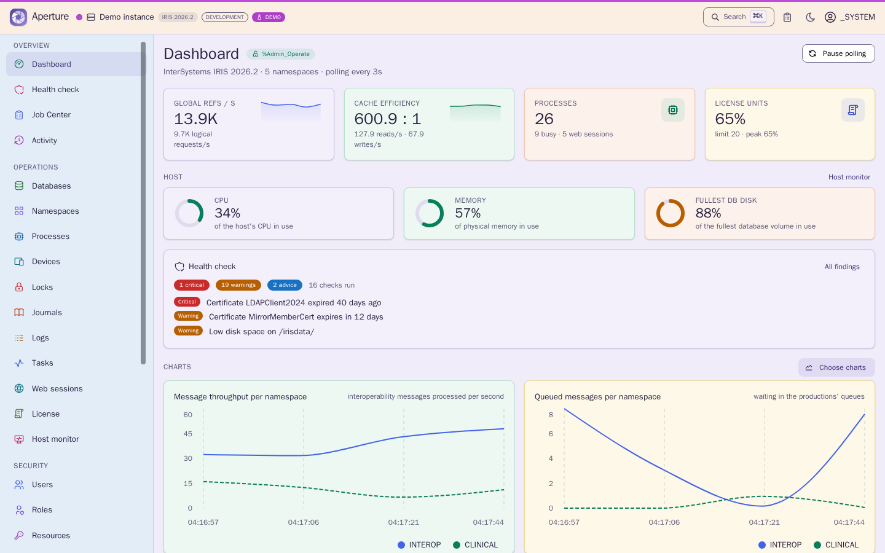
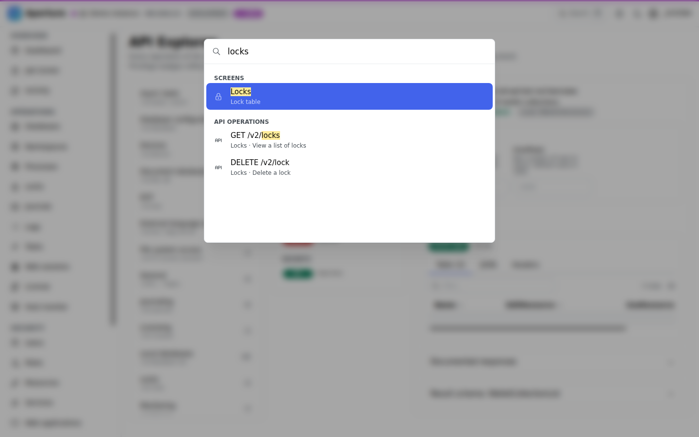
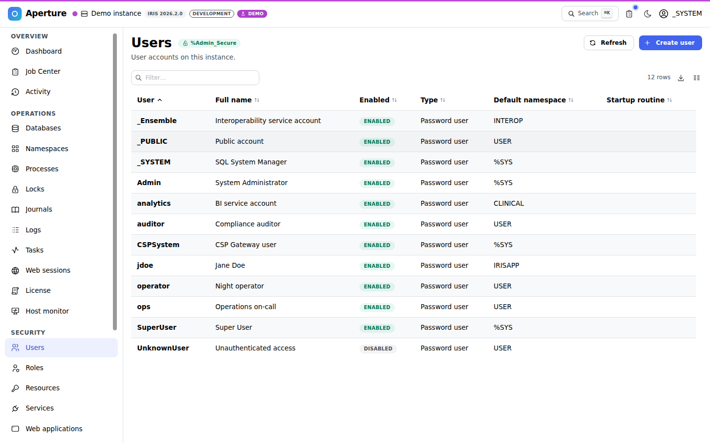
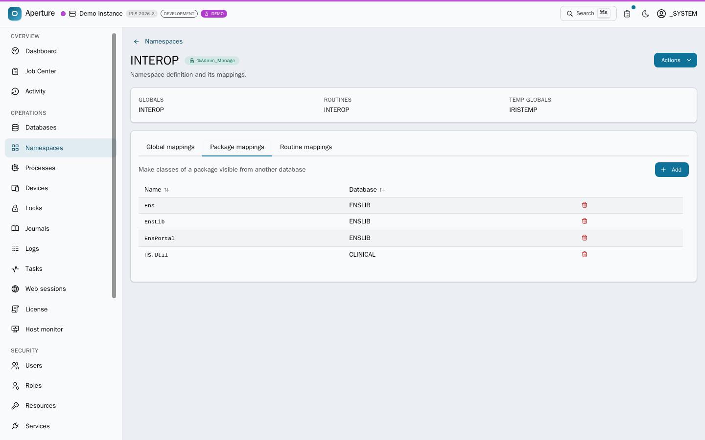
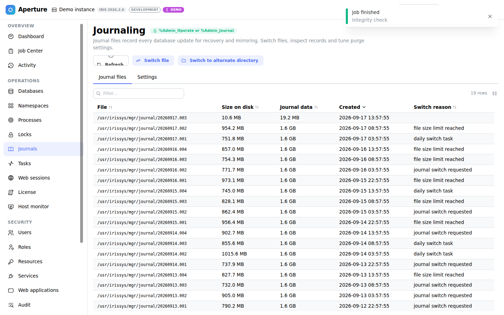
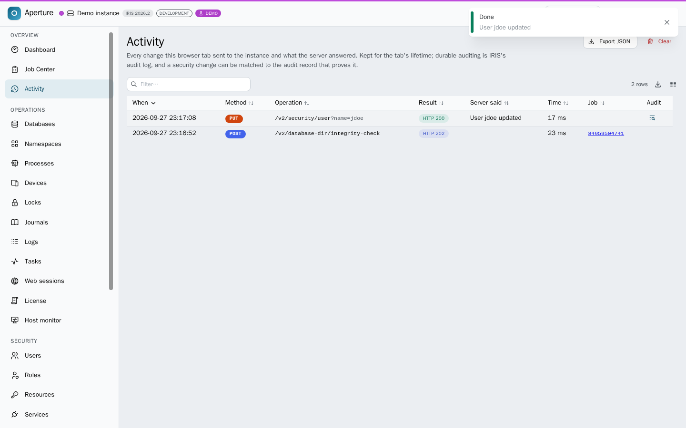
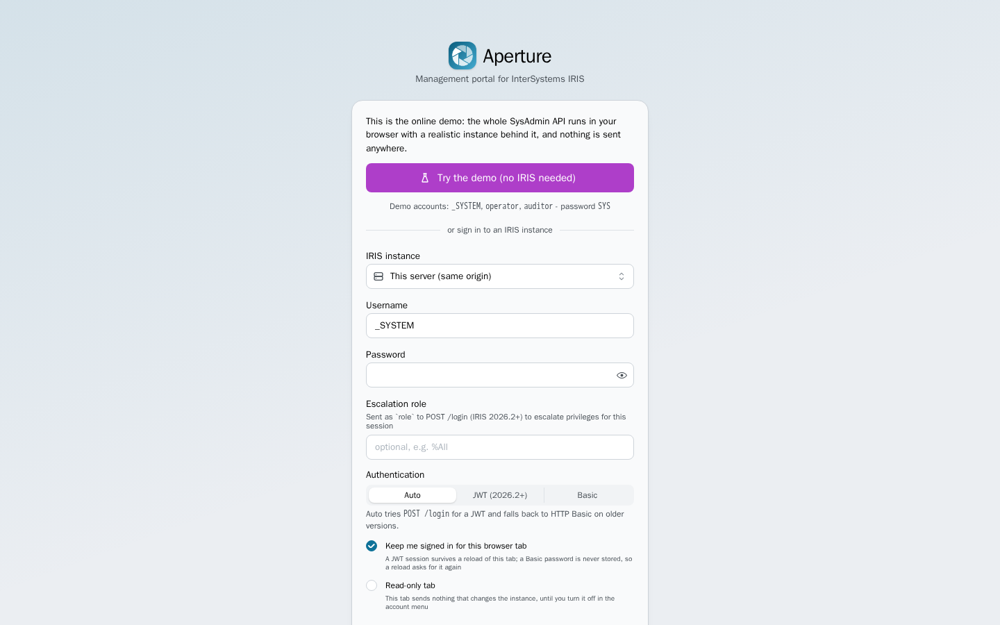
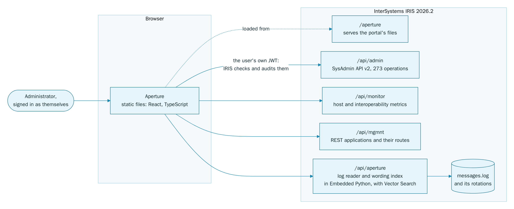

<p align="center">
  
</p>
<h1 align="center">Aperture</h1>
<p align="center"><b>A management portal for InterSystems IRIS, with no separate application server.</b></p>
<p align="center">See who loses what before you save, and find the log entries worded alike with IRIS Vector Search.</p>
<p align="center">
  <a href="https://github.com/MxSalata/aperture/actions/workflows/ci.yml"></a>
  <a href="https://github.com/MxSalata/aperture/tags"></a>
  <a href="https://mxsalata.github.io/aperture/"></a>
  <a href="https://github.com/MxSalata/aperture#docker"></a>
  <a href="https://github.com/MxSalata/aperture#ipm"></a>
  <a href="https://github.com/MxSalata/aperture/blob/main/LICENSE"></a>
</p>
<p align="center">
  <a href="https://mxsalata.github.io/aperture/"><b>Online demo</b></a> ·
  <a href="https://github.com/MxSalata/aperture#for-judges-two-minutes">For judges</a> ·
  <a href="https://github.com/MxSalata/aperture#why-aperture">Why Aperture</a> ·
  <a href="https://github.com/MxSalata/aperture#run-it-on-real-iris">Run it</a> ·
  <a href="https://github.com/MxSalata/aperture#architecture">Architecture</a> ·
  <a href="https://github.com/MxSalata/aperture#contest-technology-bonuses">Bonuses</a> ·
  <a href="https://github.com/MxSalata/aperture#verified-against-real-iris">Verification</a>
</p>
<p align="center">
  <a href="https://openexchange.intersystems.com/package/Aperture">Open Exchange</a> ·
  <a href="https://community.intersystems.com/post/aperture-management-portal-intersystems-iris-no-separate-application-server">The article</a> ·
  <a href="https://youtu.be/5U8rcPj7wJ4">The video</a> ·
  <a href="https://community.intersystems.com/post/20-places-where-sysadmin-api-specification-and-iris-disagree">The 20 spec findings</a> ·
  <a href="https://openexchange.intersystems.com/contest/48">Vote for Aperture in the contest (until 4 October)</a>
</p>


Aperture is an entry for the [InterSystems Programming Contest: Build Your Own Management Portal](https://openexchange.intersystems.com/contest/48). It is a set of static files that IRIS serves itself. Your browser calls IRIS's own [SysAdmin REST API](https://github.com/intersystems-community/sysadmin-api-specification) (`/api/admin`, 273 operations) directly, signed in as you, so IRIS checks your privileges on every call and audits you by name. The one thing that API cannot give you, the instance's log files, comes through a small read-only reader the IPM package adds, written in Embedded Python, with a wording index on IRIS Vector Search beside it.

## For judges: two minutes

1. **In your browser, nothing to install.** Open the [online demo](https://mxsalata.github.io/aperture/) and press **Try the demo**: a simulated IRIS 2026.2 runs inside the page, so change whatever you like.
   - Open **Health check**: sixteen read-only checks run with your own access, and every finding says what it means, what to do, shows its evidence and opens the screen that fixes it.
   - Open _Logs → Messages log_ (the reader asks for the password, `SYS`) and open an entry: it says how often that message was logged, and **Show similar entries** lists the entries worded like it, with when (IRIS Vector Search).
   - Open _Security → Users → jdoe_, remove a role and press Save: the review lists old → new and **who loses which privilege**.
   - Press <kbd>Ctrl</kbd>+<kbd>K</kbd> (<kbd>⌘</kbd><kbd>K</kbd>), type `databases`, open `USER` and choose _Actions → Integrity check_: the `202 Accepted` lands in the **Job Center** with console output and progress.
   - Open _REST services_ and export an application's routes as a Postman collection or a `.http` file.
   - Sign out and sign in as `operator` / `SYS`: the security area disappears, and every disabled action names the resource it needs.
2. **On real IRIS, one command.** `docker run -d --name aperture -p 127.0.0.1:52773:52773 ghcr.io/mxsalata/aperture`, then http://localhost:52773/aperture/index.html as `_SYSTEM` / `SYS` ([more](https://github.com/MxSalata/aperture#docker)).
3. **On your own IRIS 2026.2.** `zpm "install iris-aperture"`, then `/aperture/index.html` on the instance's web server ([more](https://github.com/MxSalata/aperture#ipm)).
4. **Or watch it.** The [walkthrough on YouTube](https://youtu.be/5U8rcPj7wJ4) (19 minutes) runs all three and goes through every screen.

| Demo account | Password | Privileges | What it shows |
| --- | --- | --- | --- |
| `_SYSTEM` | `SYS` | everything | the whole portal |
| `operator` | `SYS` | `%Admin_Operate`, `%Admin_Task`, `%Admin_Journal` | security screens disappear, actions explain what they need |
| `auditor` | `SYS` | `%Admin_Secure` only | only the security area is usable |

The demo is Aperture itself, built with a mock of the whole API that runs in the browser (Mock Service Worker), seeded to look like a busy instance with interoperability productions, tasks, journals, users and audit history. Writes change that in-memory instance; the same mock drives the unit and browser tests. Every real deployment also has a **Try the demo** button on its sign-in page.

## Why Aperture

- **You sign in as yourself.** No service account in the middle: `POST /login` gives you your own short-lived JWT, IRIS enforces your privileges on every call and writes your name into its audit log. The portal reads what you may do (`GET /info`) and shows exactly that.
- **All 273 operations.** Hand-made screens for the daily work, and the API Explorer renders every operation from the OpenAPI document, so nothing in the API is out of reach.
- **Who loses what, before you save.** Every edit is reviewed old → new against a fresh read of the object. A user or role change lists every account it reaches with the privileges gained and lost, and a change that would leave nobody able to administer security is refused.
- **A health check that shows its work.** Sixteen deterministic, read-only checks (disks, databases, journal, backups, auditing, open services and applications, `%All` holders, certificates, tasks, the licence, severe log entries) run with your own access. Each finding says what it means and what to do, shows the fields it read and where, and opens the Aperture screen that fixes it; a check your account may not read is listed as not checked, with the privilege it needs. No invented score.
- **Every background job in one place.** `202 Accepted` answers become jobs by themselves; the Job Center follows them with console output, progress, pause, resume and cancel.
- **Every log, and the entries worded like it.** `messages.log`, `alerts.log`, `SystemMonitor.log` and every rotation (Ideas Portal DPI-I-966), read in bounded windows. **Similar entries** finds the entries worded like any of them with IRIS Vector Search: an HNSW index over hashed words, built in Embedded Python inside IRIS, with nothing sent anywhere else.
- **Requests you do not have to type.** Any REST application's routes, and any SysAdmin operation, export as a Postman collection, a `.http` file or curl (Ideas Portal DPI-I-813).
- **Disk space you can act on.** The databases screen shows how much of each disk behind the database files is free, as a share and as a size, and says when one is running low.
- **Tested on real IRIS.** 139 operations verified on IRIS for Health 2026.2, the API contract checked against IRIS Community 2026.2 on every push, and every screen audited for accessibility in five appearance modes ([details](https://github.com/MxSalata/aperture#verified-against-real-iris)).
- **Made for long sessions.** Light, Dark and Pastel themes and high contrast, a command palette, a navigation menu you arrange yourself, charts you choose, a colour per connection so production never looks like staging, and browser tabs you can make read-only.

|  |  |
| --- | --- |
|  |  |
|  |  |
|  |  |
|  |  |
|  |  |

<details>
<summary>More screenshots</summary>

|  |  |
| --- | --- |
|  |  |
|  |  |
|  |  |
|  |  |
|  |  |
|  |  |
|  |  |
|  |  |
|  |  |
|  |  |
|  |  |

</details>

## The six contest areas

- **Web applications and REST APIs.** _Security → Web applications_ lists, shows, creates, edits and deletes them, JWT and CORS settings included, and the API Explorer has every `/v2/web-app*` operation. _REST services_ lists every REST application with the routes its dispatch class declares, from `/api/mgmnt`, exported as a Postman collection or a `.http` file or copied as curl (Ideas Portal DPI-I-813). Boundary: `/api/mgmnt` takes a password only, so a JWT session asks for it once and keeps it in the tab's memory.
- **Permission management.** Users, roles, resources, services and SQL privileges, with escalation-role sign-in. Every edit is reviewed field by field against a fresh read, a change to a role says who loses what, and one that would leave nobody able to administer security is refused. Boundary: the portal adds no privilege of its own; what the account cannot do stays visible and disabled, with the resource it needs.
- **Security and secrets.** TLS configurations with a connection test, X.509 credentials with their expiry, wallet collections and write-only secrets, OAuth 2.0 in its three roles, audit settings; LDAP, MFT, encryption and the remaining OAuth writes in the API Explorer. Boundary: passwords, secrets, tokens and private keys are redacted before they are shown, copied or exported, and wallet secret values are never fetched.
- **Task management.** Tasks with their schedules, run now or at a time, suspend and resume, their history, the task manager daemon and the upcoming runs. Boundary: a task is read again after every change, and the page says when IRIS reports something else.
- **Operating system.** Dashboard, Host monitor (CPU, memory and disk from `/api/monitor`), processes, devices, locks, databases with the free space of their disks, namespaces, journals, the License screen and web sessions; ECP, external language servers and file-system access in the API Explorer. Boundary: host measurements come from IRIS's native monitor service, not from the SysAdmin API.
- **The logs.** `messages.log`, `alerts.log` and `SystemMonitor.log` with every rotation (Ideas Portal DPI-I-966), newest first, older windows on request, a severity filter, and **Similar entries** on any entry (IRIS Vector Search); the audit log, journal records, task history, and this tab's own changes, where a security change can be matched to the audit record that proves it. Boundary: the SysAdmin API has no route for the log files, so the package's read-only reader (`/api/aperture`, Embedded Python) reads them in bounded windows; `^ERRORS` and SQL diagnostics stay in the classic portal.

Every screen and what it does, area by area: [docs/FEATURES.md](docs/FEATURES.md).

## Run it on real IRIS

### Docker

#### The image

One container: the official IRIS Community 2026.2 image with Aperture installed in it through its IPM package ([why one image](https://github.com/MxSalata/aperture#why-one-image)), in one command:

```bash
docker run -d --name aperture -p 127.0.0.1:52773:52773 ghcr.io/mxsalata/aperture
```

Then open http://localhost:52773/aperture/index.html and sign in as `_SYSTEM` (or `SuperUser`) with `SYS`, the image's demonstration password. For anything but a try-out, give the container a password of its own with `-e IRIS_PASSWORD=...`: it becomes the password of the image's accounts at the container's first start, and a restart keeps any password changed in IRIS since. To keep it running with a password of its own, use [Docker Compose](https://github.com/MxSalata/aperture#docker-compose).

CI publishes the image only after checking it against the SysAdmin API: with a password set at start, across a restart, and with the demonstration password. `latest` and an immutable `main-<sha>` tag come from `main` (the version's tag once, when it is new), `edge` from a feature branch.

#### Docker Compose

The same image, set up to stay: a password of its own, and back after a reboot. Compose runs it as one service, IRIS with Aperture inside, whose own web server serves the portal and the APIs it calls on one port, 52773 ([why one image](https://github.com/MxSalata/aperture#why-one-image)).

Two files in a folder, with no clone and no build:

1. Make a folder for it and save [`docker-compose.yml`](docker-compose.yml) there:

   ```bash
   mkdir aperture && cd aperture
   curl -fsSLO https://raw.githubusercontent.com/MxSalata/aperture/main/docker-compose.yml
   ```

2. Beside it, create a file named `.env` with the password of the instance's accounts (`_SYSTEM`, `SuperUser` and the image's others). IRIS's rules apply: by default 3 to 32 letters, digits and punctuation.

   ```ini
   IRIS_PASSWORD=choose-a-password
   # Optional: the address the ports are published on (0.0.0.0 for every interface)
   # APERTURE_BIND=127.0.0.1
   # Optional: the image tag, latest, a version such as 1.1.0, or edge
   # APERTURE_VERSION=latest
   ```

3. Start it, and wait until Compose reports it healthy (a minute or so the first time):

   ```bash
   docker compose up -d
   docker compose ps
   ```

4. Open http://localhost:52773/aperture/index.html and sign in as `_SYSTEM` with that password.

| To | Run |
| --- | --- |
| follow IRIS's console log (the password step says `Aperture image`) | `docker compose logs -f` |
| restart it (passwords changed in IRIS since are kept) | `docker compose restart` |
| update to the newest image | `docker compose pull && docker compose up -d` |
| stop and remove it | `docker compose down` |

The instance lives in its container. It keeps its data across restarts, but not when the container is removed or replaced by an update, which starts again from the image and applies `IRIS_PASSWORD` afresh. That makes it a real IRIS to use Aperture on; to manage an IRIS you already run, install the package there with [IPM](https://github.com/MxSalata/aperture#ipm). On a host with more than 20 CPU cores, see the [notes](https://github.com/MxSalata/aperture#notes).

<details>
<summary>What <code>docker-compose.yml</code> contains</summary>

```yaml
services:
  iris:
    image: ghcr.io/mxsalata/aperture:${APERTURE_VERSION:-latest}
    container_name: aperture
    command: --check-caps false --ISCAgent false
    # Back after a reboot or a crash, unless you stopped it yourself.
    restart: unless-stopped
    # IRIS shuts down cleanly on a stop, which can take longer than Docker's default 10 seconds.
    stop_grace_period: 60s
    environment:
      # The password of _SYSTEM, SuperUser and the image's other accounts, applied at the container's
      # first start (a restart keeps passwords changed in IRIS since; a new container applies it
      # again). Empty keeps the demonstration password SYS: set one for anything but a try-out.
      - IRIS_PASSWORD=${IRIS_PASSWORD:-}
    # Published on this machine only by default. IRIS's web server here speaks plain HTTP: to
    # reach it from other hosts, set IRIS_PASSWORD, put TLS in front and start with
    # APERTURE_BIND=0.0.0.0 (or a specific interface address).
    ports:
      - '${APERTURE_BIND:-127.0.0.1}:52773:52773'
      - '${APERTURE_BIND:-127.0.0.1}:1972:1972'
    healthcheck:
      test: ['CMD-SHELL', 'iris qlist IRIS | grep -q running']
      interval: 10s
      timeout: 5s
      retries: 30
```

</details>

#### Why one image

Aperture ships as one image, IRIS and Aperture together, rather than a portal container beside a stock IRIS:

- **It is the official image plus the package.** `intersystems/iris-community:2026.2`, pinned by digest, with `iris-aperture` installed at build time by the package manager: the same installation as `zpm "install iris-aperture"` on an instance of your own.
- **Aperture has no server to run.** The portal is static files that IRIS's own web server serves; a container of Aperture's own would only be a web server in front of IRIS.
- **Part of Aperture lives inside IRIS.** The log reader (`/api/aperture`, Embedded Python), the wording index that IRIS Vector Search queries, and the installer's JWT settings for `/api/admin` are installed into IRIS: a container beside a stock IRIS could not provide them.
- **The browser needs one origin.** `/api/admin` sends no CORS headers, so the portal must come from IRIS itself or from a proxy in front of both; in one container there is nothing to proxy.
- **You run what CI checked.** The image is published only after it passes the checks against the SysAdmin API.

To put nginx in front (TLS, or several instances behind one address), build the two-container setup from the sources.

#### From the sources

With nginx serving the portal in front of IRIS:

```bash
git clone https://github.com/MxSalata/aperture.git
cd aperture
docker compose -f docker-compose.build.yml up --build
```

- http://localhost:8080 - Aperture behind nginx (proxies `/api/admin`, `/api/monitor`, `/api/mgmnt` and `/api/aperture` to IRIS: same origin, so no CORS and no Basic-auth pop-ups; sends a Content-Security-Policy). A second instance goes behind the same nginx under a path prefix (`/iris-b`, the pattern is documented in [`docker/nginx/default.conf.template`](docker/nginx/default.conf.template)) and gets a connection profile with that prefix as its base URL
- http://localhost:52773/aperture/index.html - Aperture served by IRIS itself (the committed `www/` build, refreshed with `npm run build:www`)
- Sign in as `_SYSTEM` with `IRIS_PASSWORD` from `.env`, or with `SYS` when none is set.

The `iris` service is built from [`docker/iris/Dockerfile`](docker/iris/Dockerfile) on top of `intersystems/iris-community:2026.2`, pinned by digest (`sha256:cd2ebcab…50bdaa`, Build 221U). The portal image pins `node:22-alpine` and `nginx:1.30-alpine` by digest, and CI pins every GitHub Action to a commit. At build time [`docker/iris/init.script`](docker/iris/init.script) fetches the InterSystems Package Manager from the community registry (installer 0.10.9, checked against its SHA-256) and installs Aperture through its own IPM package (`zpm "load"` of [`module.xml`](module.xml)): the built portal is copied into the instance's manager directory (`mgr/aperture/`), the `/aperture` web application is created, the `/api/aperture` log reader ([`Aperture.API`](ipm/cls/Aperture/API.cls) over [`Aperture.Logs`](ipm/cls/Aperture/Logs.cls), Embedded Python) is created, and [`Aperture.Installer`](ipm/cls/Aperture/Installer.cls), also Embedded Python, enables `/api/admin` with password + JWT authentication. The build log ends with the installer's readiness report; you can print it again at any time:

```bash
docker exec aperture iris session IRIS -U USER "##class(Aperture.Installer).Doctor()"   # aperture-iris when built from the sources
```

#### Notes

- **More than 20 CPU cores.** IRIS Community stops at start-up with _Invalid Community Edition license, may have exceeded core limit_ (reported by the IRIS Atrium entry). Give the container 20 cores at most: `docker run --cpuset-cpus=0-19 ...`, or with Compose a `docker-compose.override.yml` next to the compose file: `services: { iris: { cpuset: "0-19" } }`.
- **Other machines.** The ports are published on `127.0.0.1` only by default. To use Aperture from other machines, set `IRIS_PASSWORD`, put TLS in front (nginx and IRIS's web server speak plain HTTP), then start with `APERTURE_BIND=0.0.0.0`.
- **The address.** IRIS's built-in web server needs the file name: a bare `/aperture/` answers 404.
- **IRIS for Health.** IRIS for Health Community 2026.2 is tested too, against a real instance ([evidence](docs/verification/2026-09-23-irishealth-2026.2/)): to build on it, put `IRIS_IMAGE=containers.intersystems.com/intersystems/irishealth-community:2026.2@sha256:7c06b6b3d950bc25f3e353b0a65db0c4045f251fb9103eade63514302b662cf3` in a `.env` file next to `docker-compose.build.yml`.

### IPM

```objectscript
zpm "install iris-aperture"
```

copies the pre-built portal (`www/`) into the instance's manager directory (`mgr/aperture/`, which durable %SYS keeps across container updates), creates the `/aperture` web application and the `/api/aperture` log reader (a read-only `%CSP.REST` class over an Embedded Python file reader, needs `%Admin_Operate:USE`) with its wording index (`Aperture.LogLine`, a `%Library.Vector` column under an HNSW index, the package's only tables), and runs [`Aperture.Installer`](ipm/cls/Aperture/Installer.cls), an Embedded Python class that enables `/api/admin` with password and JWT authentication and prints a readiness report (IRIS version, JWT availability, the API's authentication settings, the portal's files, the log reader and the log files it can read). Then open `http://<host>:52773/aperture/index.html`. From a checkout, `zpm "load /path/to/aperture"` installs the same package; `##class(Aperture.Installer).Doctor()` prints the report again.

### Requirements on the IRIS side

- IRIS or IRIS for Health **2026.2+** with the `/api/admin` web application. Aperture speaks SysAdmin API v2, which ships with 2026.2; IRIS 2026.1 serves only v1 (every `/v2` path answers 404) and older releases have no SysAdmin API, so sign-in there stops with an explanation. Sign-in uses JWT and falls back to HTTP Basic when `/login` is unavailable (for example with JWT authentication switched off on `/api/admin`).
- The account needs at least one `%Admin_*` privilege (`GET /info` refuses everyone else).
- _Logs → Messages log_ reads the log files through the package's own `/api/aperture` web application (created by `zpm "install"`, `zpm "load"` and the Docker image; password authentication, `%Admin_Operate:USE`). On an instance without the package that screen says so and everything else works.
- The portal must be served from the same origin as the API it talks to: `/api/admin/v2` sends no CORS headers, by design (InterSystems, in the contest announcement thread, 22 September 2026), so a browser cannot call it across origins whatever the web application's allow-list says. The three supported topologies are all same-origin: nginx in front of IRIS (compose), the `/aperture` web application served by IRIS itself (IPM), and the Vite dev server's proxy. Further instances go behind the same nginx under a path prefix.

### Development

```bash
npm install
cp .env.example .env           # VITE_IRIS_URL=http://localhost:52773
npm run dev                    # http://localhost:5173, /api/admin proxied to IRIS
```

Other scripts:

| Script | What it does |
| --- | --- |
| `npm run build` | type-check + production build (`dist/`, browser routing, for nginx) |
| `npm run build:www` | build for IRIS-hosted deployment (`www/`, relative URLs + hash routing) |
| `npm run build:demo` | build the online demo (`dist-demo/`, in-browser mock) |
| `npm test` | Vitest unit tests (client, auth, privileges, async jobs, spec index) |
| `npm run test:e2e` | Playwright end-to-end tests against the demo build, with axe-core WCAG 2.1 AA audits |
| `npm run smoke` | walks the main screens in headless Chromium and refreshes `docs/screenshots/` |
| `npm run verify:live` | conformance check of a real instance (`IRIS_URL`, `IRIS_USER`, `IRIS_PASSWORD`), the log reader included, saves JSON evidence |
| `npm run gen:api` | regenerate `src/api/schema.d.ts` and the operation index from `spec/mainspec_v2.json` |

## Architecture



| Endpoint | What Aperture uses it for |
| --- | --- |
| `/aperture` | the portal's static files, served by IRIS (or by nginx, or by GitHub Pages for the demo) |
| `/api/admin` | SysAdmin API v2: administration, sign-in (JWT, or HTTP Basic where JWT is off) and the account's privileges |
| `/api/monitor` | host CPU, memory and disk, licence use and the interoperability metrics |
| `/api/mgmnt` | the instance's REST applications and the routes their dispatch classes declare |
| `/api/aperture` | the package's own read-only log reader and wording index (Embedded Python, IRIS Vector Search) |

The portal and the APIs share an origin (the SysAdmin API sends no CORS headers, by design), so the same build is served by IRIS itself, behind nginx, or by the Vite dev server's proxy; the demo swaps the network for the in-browser mock. More in [docs/ARCHITECTURE.md](docs/ARCHITECTURE.md).

<details>
<summary>How the client works</summary>

- **Typed client.** `openapi-typescript` turns `spec/mainspec_v2.json` into `src/api/schema.d.ts`; `openapi-fetch` gives compile-time checked paths, query parameters, bodies and responses for every operation.
- **Envelope handling.** `call()` / `result()` unwrap `{ status: { Errors, summary }, console, result }` and turn any non-2xx into an `ApiError` carrying the server's summary and console lines.
- **Authentication.** `POST /login` → JWT access + refresh tokens (IRIS 2026.2+). A fetch middleware adds the bearer header, refreshes proactively before expiry and once more on a 401, then retries the request with its original body; a retry IRIS refuses too ends the session at once. If `/login` does not exist, the client falls back to HTTP Basic. Escalation roles are supported via the `role` field of `/login`.
- **Asynchronous operations.** The same middleware watches for `202 Accepted`, parses the `Location` header (`/v2/async-result?id=…`) and registers a job. The Job Center polls until `Finished | Failed | Canceled`, shows `Console`, `Result` and `ProgressCurrent/ProgressTotal`, and invalidates cached queries when a job completes.
- **Privileges.** `GET /info` reports the user's `%Admin_*` permissions. Navigation, the command palette and every page header use them; unknown resources (older servers) stay optimistic.
- **Spec-driven Explorer.** A build step (`scripts/build-spec-index.mjs`) extracts a compact index (method, path, group, privileges, parameters, async flag); the full document is lazy-loaded only when the Explorer needs schemas to build forms and examples. The same index and schemas produce the requests other tools take: `src/lib/requestExport.ts` writes a Postman collection (format v2.1), a `.http` file or a curl command from any list of generated requests, whether they come from the SysAdmin document (`features/explorer/requests.ts`) or from a REST application's Swagger 2.0 (`api/mgmnt.ts`); the password stays in the browser and body secrets are redacted.
- **Log reader.** The SysAdmin API has no route for the instance's log files, so the IPM package adds one of its own: `/api/aperture`, a read-only `%CSP.REST` class (`ipm/cls/Aperture/API.cls`) over an Embedded Python file reader (`Logs.cls`). It catalogues `messages.log` (wherever `ConsoleFile` puts it), `alerts.log`, `SystemMonitor.log` and their rotations, and answers windows of whole lines of at most 256 KiB ending at a byte offset, so a client pages backwards at constant cost whatever the file's size; a file is named by its catalogue id, never by a path, and every route needs `%Admin_Operate:USE`. The browser parses the lines (`src/lib/messagesLog.ts`); the mock serves generated files so the demo has them too. `GET /logs/similar` only reads: before it searches, the portal brings the wording index up to date with `POST /logs/index`, whose refreshes run one at a time.
- **Demo / tests.** The MSW handlers in `src/mocks` implement the API against an in-memory instance, including JWT issuance, privilege enforcement, 202 tasks with progress, and a spec-driven fallback for every operation without a hand-written handler. The same handlers run in the browser (demo) and in Node (Vitest, Playwright).

</details>

## Security

- **Only your own tokens.** The portal holds the tokens IRIS gave you, in the browser tab's sessionStorage for the tab's life, and ends the session as soon as IRIS refuses them. Other passwords it needs (the log reader's, for a JWT session) stay in the tab's memory.
- **A small footprint on the instance.** At run time the package writes nothing but its own wording index, two tables in its namespace; the log reader only reads, in bounded windows, the files IRIS itself writes. At install time it creates its two web applications and enables password and JWT authentication on `/api/admin`: review that before installing on an existing instance.
- **No script but the portal's own.** Every page carries a Content-Security-Policy, as a header behind nginx and in the page itself when IRIS or GitHub Pages serves it, that admits scripts from the portal's own files only and calls to its own origin only.
- **Run it behind TLS.** IRIS's web server and the nginx here speak plain HTTP.

## Contest technology bonuses

| Bonus | Where to see it |
| --- | --- |
| Community Opportunity ideas | [DPI-I-966](https://ideas.intersystems.com/ideas/DPI-I-966): every rotated `messages.log` readable in the portal (Logs → Messages log). [DPI-I-813](https://ideas.intersystems.com/ideas/DPI-I-813): requests generated from OpenAPI for Postman, VS Code and curl (REST services → Export; API Explorer) |
| Embedded Python | [`Aperture.Installer`](ipm/cls/Aperture/Installer.cls) (configures `/api/admin`, prints the readiness report), [`Aperture.Logs`](ipm/cls/Aperture/Logs.cls) (the log reader), [`Aperture.LogIndex`](ipm/cls/Aperture/LogIndex.cls) and [`aperture_vectors.py`](ipm/python/lib/aperture_vectors.py) (the wording index) |
| Vector Search | [`Aperture.LogLine`](ipm/cls/Aperture/LogLine.cls): a `%Library.Vector` of 256 doubles under a `%SQL.Index.HNSW` index; `/api/aperture/logs/similar` ranks with `VECTOR_COSINE` (Logs → Messages log: open an entry) |
| Docker | `ghcr.io/mxsalata/aperture`, [`docker-compose.yml`](docker-compose.yml), [`docker-compose.build.yml`](docker-compose.build.yml) |
| IPM | `zpm "install iris-aperture"` ([`module.xml`](module.xml)) |
| Online demo | https://mxsalata.github.io/aperture/ |
| Articles | [Aperture: a management portal for InterSystems IRIS, with no separate application server](https://community.intersystems.com/post/aperture-management-portal-intersystems-iris-no-separate-application-server) and [20 places where the SysAdmin API specification and IRIS disagree](https://community.intersystems.com/post/20-places-where-sysadmin-api-specification-and-iris-disagree), on the Developer Community |
| YouTube video | [Aperture: a Management Portal for InterSystems IRIS on the SysAdmin REST API](https://youtu.be/5U8rcPj7wJ4): the online demo, the IPM install on IRIS for Health 2026.2 and the Docker image, then every screen |
| First-time contribution | The author's first InterSystems programming contest (the Newcomer badge on the contest page) |

## Ideas Portal ideas Aperture implements

Two ideas with the "Community Opportunity" status on the [InterSystems Ideas Portal](https://ideas.intersystems.com) are implemented here; each is one screen away in the demo.

- **[DPI-I-966 Option to show older message.log in IRIS SMP](https://ideas.intersystems.com/ideas/DPI-I-966).** The idea: "It would be nice that we could choose in SMP portal to display any `messages.old_*` file"; today that takes a remote desktop session to the server. In Aperture, _Logs → Messages log_: the package's log reader (`/api/aperture`, Embedded Python) catalogues `messages.log`, `alerts.log`, `SystemMonitor.log` and every rotation IRIS or an administrator leaves beside them (`messages.old_20260412_1`, `messages.log.1`, `messages_20260412.log`), newest first, and a rotation reads exactly like the current file: windows of whole lines, newest first, older on request, the same severity filter. Verified on IRIS Community 2026.2 in CI (`verify-iris`).
- **[DPI-I-813 Make REST API Debugger for VSCode Recognise Open API Spec](https://ideas.intersystems.com/ideas/DPI-I-813).** The idea: requests should come from the OpenAPI description instead of being typed field by field, and be importable into Postman; it is written for the VS Code ObjectScript extension's REST debugger. In Aperture, every REST application's routes (_REST services → Export_) and every SysAdmin operation (_API Explorer → Export_, and "Request for curl, VS Code and Postman" under each operation) become ready requests: method, path, path and query parameters with their types, examples and required flags, an example body from the schema, the privileges needed. They are saved as a Postman collection (format v2.1, one folder per group, Basic auth from variables), as a `.http` file the VS Code REST Client extension and JetBrains IDEs run, or copied as curl. The password is never written into a file, and secret values in a body are redacted.

## Verified against real IRIS

- **On IRIS for Health 2026.2** (Build 221U), [docs/COVERAGE.md](docs/COVERAGE.md) accounts for every one of the 273 operations: 139 verified on that instance (every read that had an object to read, and each write with its evidence, undone after its check); a hand-made screen calls 139 as well, a different set with more writes in it, and the online demo answers 173. Every screen was walked as an administrator and as an operator, from a browser in another time zone ([evidence](docs/verification/)).
- **On IRIS Community 2026.2, in CI, on every push:** the `verify-iris` job builds the image (Aperture installed by `zpm "load"` of its `module.xml`, the Embedded Python installer), starts it and runs [`scripts/live-check.mjs`](scripts/live-check.mjs): JWT sign-in and refresh, `/info`, list shapes, the error envelope, a full `202` round trip, the portal served at `/aperture/index.html`, the log reader and a similar-entries query on the wording index. It checks the image with a password set at start and with the demonstration one before publishing it.
- **Everywhere else:** `npm run verify:live` runs the same check against your instance ([docs/VERIFICATION.md](docs/VERIFICATION.md)); the answers of real instances are also the second oracle of the mock's contract test.

## What it does not do yet

- Mirroring, ECP, LDAP, MFT, encryption, external language servers and file-system access are reachable through the API Explorer rather than hand-made screens.
- SQL, globals and classes are outside the SysAdmin API, and outside Aperture; `^ERRORS` and SQL diagnostics stay in the classic Management Portal.
- Interoperability productions show as charts of messages and queues, not as a production editor.
- Similar entries match wording, not meaning: two messages that describe one fault in different words are not paired.
- The log reader and the wording index need the IPM package (or the Docker image); without them the Messages log says so and everything else works.

## Spec findings

Implementing the whole specification against real instances turned up 20 places where it and IRIS 2026.2 disagree: fields with another name or type, a row limit that returns half of what was asked, an operation served at another path, a finished task whose second read raises an alert on the instance. Each is in [docs/SPEC_FINDINGS.md](docs/SPEC_FINDINGS.md) with its evidence, and Aperture handles all of them. They are also published, with the evidence, as [20 places where the SysAdmin API specification and IRIS disagree](https://community.intersystems.com/post/20-places-where-sysadmin-api-specification-and-iris-disagree) on the Developer Community.

## Documentation

| File | Purpose |
| --- | --- |
| [docs/FEATURES.md](docs/FEATURES.md) | every screen, area by area, and where it lives in the code |
| [docs/SPEC_FINDINGS.md](docs/SPEC_FINDINGS.md) | the 20 places where the specification and IRIS 2026.2 disagree, with their evidence |
| [docs/ARCHITECTURE.md](docs/ARCHITECTURE.md) | how the layers fit: typed client, auth, async jobs, privileges, mock, deployment |
| [docs/COVERAGE.md](docs/COVERAGE.md) | all 273 operations: the screen that calls each, what a real IRIS for Health instance answered (139 verified), and what the demo answers |
| [docs/VERIFICATION.md](docs/VERIFICATION.md) | the conformance check against a real instance, and how to run it against yours |
| [docs/verification/](docs/verification/) | recorded answers of real IRIS 2026.2 instances, one folder per run, the evidence for the spec findings |
| [CHANGELOG.md](CHANGELOG.md) | what changed, and why |

## Tech stack

React 19 · TypeScript 5.9 · Vite 7 · Mantine 8 (+ charts, spotlight, notifications, modals) · TanStack Query 5 · TanStack Table 8 · React Router 7 · zustand · openapi-typescript / openapi-fetch · Mock Service Worker 2 · Vitest 4 · Playwright · nginx · IPM · ObjectScript (`%CSP.REST`, `%Persistent`) · Embedded Python (installer, log reader, wording index) · IRIS Vector Search (`%Library.Vector`, `%SQL.Index.HNSW`, `VECTOR_COSINE`)

## License

MIT, see [LICENSE](LICENSE).
