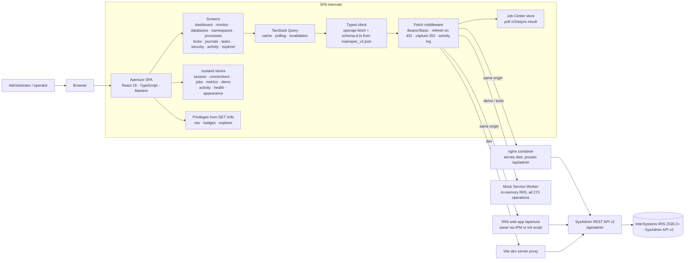

# Architecture

Aperture is a pure front-end: there is no server-side code of its own. Everything it shows or
changes goes through the InterSystems IRIS **SysAdmin REST API v2** (`/api/admin`). This document
explains how the pieces fit, in enough detail to extend the portal or reuse the patterns.

## 1. Layers

```
┌─────────────────────────────────────────────────────────────────────────┐
│ features/           screens (dashboard, databases, security, explorer…)  │
│ components/         DataTable, KeyValueList, PageHeader, ConfirmDanger…  │
├─────────────────────────────────────────────────────────────────────────┤
│ api/hooks.ts        useApiMutation, useAsyncResult, jobHeaders           │
│ api/client.ts       openapi-fetch client + middleware (auth, 401, 202)   │
│ api/schema.d.ts     generated from spec/mainspec_v2.json                 │
│ api/privileges.ts   %Admin_* ↔ GET /info                                 │
│ lib/openapi.ts      runtime access to the spec (Explorer, mock fallback) │
├─────────────────────────────────────────────────────────────────────────┤
│ stores/             zustand: session, connections, jobs, metrics, demo,  │
│                     activity, health, appearance                        │
├─────────────────────────────────────────────────────────────────────────┤
│ mocks/              MSW handlers = demo mode = test fixtures             │
└─────────────────────────────────────────────────────────────────────────┘
```

The same picture as a data-flow diagram, from the browser to the instance:



## 2. The API layer

### 2.1 Types from the specification

`npm run gen:api` runs two generators:

1. `openapi-typescript spec/mainspec_v2.json → src/api/schema.d.ts` produces the `paths` and
   `components` interfaces. Every call such as
   `api().GET('/v2/database-dir', { params: { query: { dir } } })` is checked at compile time:
   unknown paths, missing required query parameters, wrong body shapes and misspelled result
   properties are all errors.
2. `scripts/build-spec-index.mjs → src/api/spec-index.json` extracts a compact operation index:
   method, path, tag (group), the `(%Admin_X:U)` privilege prefix parsed out of the summary,
   query parameters (path-level and method-level merged, `$ref`s resolved), whether the operation
   answers `202`, and the documented responses. The index powers the navigation of the Explorer,
   the command palette and privilege badges without loading the 1 MB document. The full document is
   lazy-loaded (`lib/openapi.ts#loadSpec`) only when schemas are needed.

### 2.2 The envelope

Every v2 response is `{ status: { Errors: string[], summary: string }, console: string[], result: T }`.
`api/client.ts` offers three helpers:

| Helper | Returns | Use |
| --- | --- | --- |
| `call(promise)` | `{ data, response }` | when you need headers (e.g. `Location`) |
| `result(promise)` | `result` payload, typed | reads |
| `envelope(promise)` (aliased `run` in hooks) | `{ data, response, console, summary }` | writes - the summary becomes the success toast |

Non-2xx responses become `ApiError` with `status`, `summary`, `errors[]` and `console[]`.
`ErrorAlert` renders them with an expandable details section.

### 2.3 Authentication

```
login(auth = auto)
  ├─ POST /login {user, password, role?}   → 200 {result:{access_token, refresh_token, exp}}  → mode = jwt
  │                                        → 404/405/501 or non-JSON                          → fall back
  └─ GET /info with Authorization: Basic   → 200 Info                                          → mode = basic
```

- **JWT (IRIS ≥ 2026.2).** The access token goes into `Authorization: Bearer …`. On IRIS 2026.2
  (defaults of the `/api/admin` web application) access tokens live 60 s and refresh tokens 900 s;
  a refresh issues a new pair and the previous access token stops working at once, and presenting a
  refresh token that was already used revokes the whole session. So:
  - the middleware refreshes proactively when the token has less than 20 s left, counted from the
    token's lifetime (`exp - iat`) on the browser's clock, so clock skew cannot make every request
    refresh; and reactively once on a `401` (the original body is stashed per request id so the
    retry can resend it). Concurrent refreshes are de-duplicated with a shared promise;
  - a `401` for a request sent with a token that is no longer the current one is stale (a refresh
    finished while it was in flight): it is retried with the current token, never answered with a
    second refresh, which would revoke the token every other request just switched to;
  - one browser tab per session (`stores/sessionLock.ts`): duplicating a tab copies its
    sessionStorage and so the refresh token, and the second tab to refresh would get both sessions
    revoked. The tab that signed in holds a Web Lock named after its session; a copy finds it taken
    and drops its tokens locally (no remote logout, which would end the original too). A restored
    JWT session is not used before this is settled.
  If the refresh fails the session ends with a reason that the login page shows.
- **Basic.** Credentials are sent on every request. Because the browser would otherwise show its
  native login dialog on a `401` with `WWW-Authenticate: Basic`, nginx strips that header
  (`proxy_hide_header WWW-Authenticate`) and fetches are made with `credentials: 'omit'`.
- Tokens live in `sessionStorage` (per tab, gone when the tab closes). `RequireAuth` re-validates a
  restored session with `GET /info` before rendering anything.
- `role` is passed through to `/login` for **escalation roles**.

### 2.4 Asynchronous operations (202)

Some operations are queued by IRIS: database compaction, defragmentation, integrity checks,
database metrics, audit-log queries, journal record listings. They answer
`202 Accepted` with `Location: …/v2/async-result?id=<GUID>`.

- The middleware notices the `202`, extracts the id and calls `useJobs.track()`. Request headers
  `x-aperture-job` / `x-aperture-subject` give the job a readable name; `x-aperture-silent`
  keeps it out of the Job Center (used for metric lookups).
- `JobPoller` (mounted once in the layout) polls `GET /v2/async-result?id=` every 1.5 s for each
  non-terminal job with TanStack `useQueries`, updates the store, shows a toast on completion and
  invalidates cached queries so tables refresh. A `404`/`403` (task belongs to another user, instance
  restarted) marks the job **Missing** instead of polling forever.
- `useAsyncResult()` is the local variant for screens that want the result inline (database
  metrics, audit records, journal records).
- Progress: results derived from `AsyncTaskResultSysBGTask` carry `ProgressCurrent/ProgressTotal/ProgressUnits`;
  the Job Center renders them as a progress bar.

### 2.5 Activity log and reachability

The same middleware records every non-GET call (method, path, status, the server's summary,
duration, job id) in the `activity` store, shown on the Activity screen and exportable as JSON.
`call()` also feeds the `health` store: a network failure flips the header pill to OFFLINE with
the error, and so does a 502/503/504, which is the proxy or Web Gateway answering for an instance
that did not (its HTML error page becomes one line, e.g. `502 Bad Gateway`); the next successful
response flips it back to LIVE. The dashboard adds a PARTIAL DATA
badge when some of its polls fail, so a broken source is never hidden behind stale numbers.

### 2.6 Change review

`reviewChanges()` (`components/ReviewChanges.tsx`) wraps every edit form: it diffs the loaded
object against the form values, lists old → new per field, re-reads the object from the server to
detect concurrent edits (an "Apply anyway" checkbox overrides), and only then runs the mutation.
No dialog is shown when nothing changed.

### 2.7 Native monitor API

`api/monitor.ts` reads `/api/monitor/metrics` (OpenMetrics text, parsed by `parsePrometheus`) and
`/api/monitor/alerts` for host-level signals the SysAdmin API lacks. JWT tokens are scoped to
`/api/admin`, so only Basic credentials are forwarded; an unauthenticated or missing monitor app
is reported as unavailable rather than failing the screen.

`/api/monitor/alerts` is a cursor shared by every client of the instance: "When
/api/monitor/alerts is called, it returns the alerts that have been generated since the previous
time /api/monitor/alerts was called" (InterSystems, *Monitoring InterSystems IRIS via REST*). A
read therefore consumes the alerts for everyone, including a Prometheus or SAM scraper.
`features/monitor/useAlertLog.ts` never reads it on its own (`enabled: false`: no mount, poll or
invalidation fetches it), reads it when the Host monitor's *Read new alerts* is pressed, and keeps
every batch for the session. Counts come from `/metrics`, which is not consumed:
`iris_system_alerts_log` (alerts in the log) and `iris_system_alerts_new` (new alerts waiting).

### 2.8 Spec quirks

`lib/quirks.ts` lists known differences between the specification and running instances with their
source; the Explorer shows them beside the affected operation and applies body adapters before sending.

### 2.9 Privileges

`GET /info` returns `privileges: { Operate: {use}, Manage: {use}, Secure: {use}, … }`.
`api/privileges.ts#checkPrivileges(info, ['%Admin_Manage:U', '%Admin_Operate:U'])` returns
`granted | denied | unknown` (unknown = the server did not report that key, e.g. an older version;
the UI stays optimistic). Navigation sections, the command palette, page headers (`PrivilegeBadge`)
and the Explorer all use it.

### 2.10 Time

IRIS reports timestamps as the wall-clock time of the instance, with no zone designator
(`2026-12-31 23:59:59`); on IRIS 2026.2 every timestamp field is of that form, except the audit
log's `UTCTimeStamp` and a process's `StartTimeUTC` (UTC, also without a designator) and the
entries of `/api/monitor/alerts` (`…Z`). Aperture never converts the text: what the API says is
what the screen shows. Relative times ("3 hours ago"), sorting by instant and the audit window of
the Activity screen need an instant, read on the instance's clock:

1. the IANA zone the connection profile names (Connections), exact across daylight-saving changes;
2. else the instance's UTC offset measured from its clock (`LastUpdate` of
   `/v2/monitor/system-usage` is its wall clock of this moment; `offsetFromWallClock` accepts only
   a reading within 3 minutes of a whole quarter hour, and it is re-measured every 30 minutes);
   right until the next daylight-saving change, and the portal says once per session that naming
   the zone makes it exact;
3. else (no `%Admin_Operate` to measure with) the browser's zone.

Checked by `e2e/live/time.spec.ts` in a browser in New York against an instance in London: without
the measurement every instant was 300 minutes off ("finished in 5 hours" for a task that ran
minutes ago). The portal's own instants (when a change was sent, chart axes) are shown on the same
clock, so a screen never mixes two zones. `lib/format.ts` holds the policy; `Timestamp` shows one
reading and the other in a tooltip that names the clock used. Both are reset with the session, not
on unmount (React's StrictMode runs unmount cleanups right after mounting).

## 3. State

| Store | Persisted in | Holds |
| --- | --- | --- |
| `session` | sessionStorage | connection, mode, tokens, `/info` |
| `connections` | localStorage | saved IRIS instances |
| `jobs` | sessionStorage | followed async tasks |
| `metrics` | sessionStorage | ring buffer of dashboard samples (120 × 3 s) |
| `demo` | sessionStorage | whether the in-browser mock is active |
| `activity` | sessionStorage | changes sent from this tab |
| `health` | memory | reachability of the instance |
| `appearance` | localStorage | contrast setting (system / normal / high); the colour scheme itself is Mantine's own localStorage key |

Everything that describes *the instance we were talking to* (the query cache, jobs, metric
history, the activity log, reachability) is reset by `resetInstanceState()` in `stores/session.ts`
on logout and on a sign-in to a different instance; `connections` and `appearance` are device
preferences and survive. `DataTable` keeps its own state outside the stores: filter, sort and page
in the URL (`?q=&sort=-Pid&page=2`) when the table is keyed, column choices and page size in
localStorage under `aperture.table.<key>`.

Server state is entirely TanStack Query: `staleTime` 10 s, one retry after a `401`, no retry on other
4xx. Mutations go through `useApiMutation`, which toasts the envelope summary, toasts `ApiError`s
and invalidates the query keys you list.

## 4. Screens

Hand-written screens follow one shape: `PageHeader` (title, description, privilege badge, actions),
a `DataTable` (TanStack Table: sorting, quick filter, column chooser, pagination, sticky header, CSV export, URL-backed state) or a
`KeyValueList` for details, Mantine modals with `@mantine/form` for create/edit, and `confirmDanger`
for destructive actions (type-the-name confirmation for irreversible ones). Every detail page also
shows the raw JSON of the responses it used.

The **Explorer** (`features/explorer`) is generic: it lists groups from the index, renders query
parameters as inputs (enums as selects, booleans as selects), builds a request-body form from the
resolved JSON schema (flat fields) with a JSON tab for nested ones, pre-fills examples from the spec,
executes through the same client (so 202s land in the Job Center) and shows the result as a table,
fields or JSON.

Three rules sit at the render boundary rather than in individual screens:

- **Secrets never become UI content.** `lib/redact.ts` replaces string values under a secret key
  (`Password`, `ClientSecret`, `PrivateKeyPassword`, `InitialAccessToken`, `KeyValueSecret`, …)
  with a placeholder. `JsonViewer` applies it before the text exists (so the clipboard never holds a
  secret, and a badge says how many values were hidden), `objectToItems` applies it to every detail
  page and the Explorer's field view, `DataTable` applies it to CSV export and `reviewChanges`
  to its old → new table. Keys are compared without `_`/`-`, so OAuth/JWT payloads
  (`access_token`, `refresh_token`, `registration_access_token`) are covered; every string inside
  an object held under a secret key (`Secret`, `WalletSecretConfig`) is hidden; and in a
  name/value list (process variables) a secret `Name` hides its `Value`. Configuration keys that
  merely mention a secret word (`PasswordNeverExpires`, `PrivateKeyFile`, `AccessTokenInterval`,
  `…_signed_response_alg`) pass through; the rule is unit-tested against the specification's
  vocabulary.
- **A change is only as real as the read-back.** After a task suspend or resume the detail page
  re-reads `/v2/task/info` and says when IRIS still reports the previous state (see
  `lib/quirks.ts`, `task-suspended-lag`). The Activity screen can match a security write to the
  `%System/%Security/<Event>` audit record that proves it: `lib/auditEvents.ts` maps the request
  path to the event, the audit log is queried as an asynchronous task around the request time, and
  the closest matching record is shown next to the HTTP result.
- **Every log the API exposes has one door.** The **Logs** hub (`features/logs`) lists the audit
  database, journal files, `alerts.log` from the native monitor service, task history and this tab's
  changes with counts and the latest entry, gates each card on the privilege it needs, and says
  which logs (`messages.log`, `^ERRORS`, SQL diagnostics) have no API route.

## 5. Deployment topologies

| Mode | Build | Router | Origin of `/api/admin` |
| --- | --- | --- | --- |
| `npm run dev` | - | browser | Vite proxy → `VITE_IRIS_URL` |
| nginx container | `npm run build` → `dist/` | browser | nginx `proxy_pass` → IRIS |
| IRIS-hosted (`/aperture`) | `npm run build:www` → `www/` | hash, relative assets | same origin |
| Online demo (static host) | `npm run build:demo` → `dist-demo/` | hash, relative assets | in-browser mock |

Hash routing is used wherever there is no server to rewrite deep links to `index.html`.

There is one installation path. `module.xml` copies `www/` to `{$cspdir}aperture/`, creates the
`/aperture` web application and invokes `Aperture.Installer` (`ipm/cls/Aperture/Installer.cls`),
whose Embedded Python `Configure` sets `Enabled=1`, adds password authentication to `AutheEnabled`
(bit 32) and sets `JWTAuthEnabled=1` on `/api/admin` through `Security.Applications`; its `Doctor`
prints a readiness report. The Docker image (`docker/iris/Dockerfile`, official Community image plus the package manager) runs that same package with
`zpm "load"` at build time (`docker/iris/init.script`), so a `docker compose build` is also an
install test of the IPM package.

## 6. Mock instance (demo + tests)

`src/mocks` implements the API with Mock Service Worker:

- `auth.ts` issues structurally valid JWTs (fake signature) with 15-minute access and 24-hour
  refresh tokens; four accounts have different `%Admin_*` sets.
- `secure.ts#route()` wraps every handler with authentication and privilege enforcement, so a
  `403` in the demo means exactly what it would mean on IRIS.
- `db.ts` seeds namespaces, databases, processes, locks, journals, tasks, users, roles, resources,
  services, web applications, audit events, sessions and TLS configs; `async.ts` simulates queued
  tasks with console output, progress, pause/resume/cancel.
- `handlers/generic.ts` answers **every other** operation from the spec: it checks privileges from
  the index and generates an example from the response schema, so the demo really covers all 273
  operations.
- `monitor.ts` produces drifting metrics so the dashboard charts move.

The same handlers run under Node for Vitest (`src/test/setup.ts`) and in Chromium for Playwright.

Because the mock is the oracle of both test suites and of the demo, `src/mocks/__tests__/contract.test.ts`
checks its answers against the specification: every parameterless GET and the detail reads the
screens edit are validated against their response schemas (type, enum, items, properties). A mock
that drifted from the spec would otherwise make the tests agree with the mock and not with IRIS,
which is how a role editor written for `Resources: string[]` survived while the API sends
`[{ Name, Permissions }]`. The one allow-listed divergence is `database-dirs`, where real servers
differ from the spec and the mock follows the servers.

`e2e/a11y.spec.ts` runs axe-core (WCAG 2.1 A/AA) over the sign-in page and nine screens in light,
dark, and both high-contrast modes (Playwright emulates `prefers-color-scheme` and
`prefers-contrast`). Serious and critical findings fail the run. Colour contrast is solved at the
token level in `src/styles.css`, not per component: each of Mantine's `filled`, `text`, `outline`
and `light-color` variables points at the shade nearest Mantine's own that reaches 4.5:1 on the
surfaces it sits on, so any `color="…"` prop is legible without a local override.

## 7. Extending

- **New screen for an existing group:** copy a feature folder, use `result(api().GET(...))` with the
  typed path, add the route in `routes.tsx` and a nav item in `features/shell/nav.ts` with its
  privileges.
- **New API version:** replace `spec/mainspec_v2.json`, run `npm run gen:api`, fix type errors.
- **Charts:** colors come from `lib/chartColors.ts` (validated categorical palettes for light and dark).
