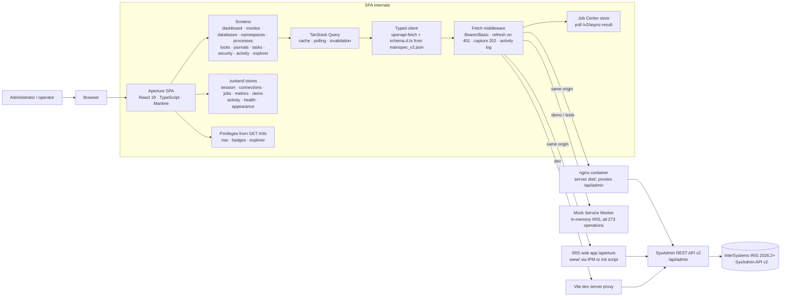

# Architecture

Aperture is a front-end: everything it shows or changes goes through the InterSystems IRIS
**SysAdmin REST API v2** (`/api/admin`), with two native services beside it (`/api/monitor` for host
metrics, `/api/mgmnt` for REST routes) and one small read-only REST class of its own on the instance
for the log files the API has no route for (§2.7b). This document explains how the pieces fit, in
enough detail to extend the portal or reuse the patterns.

## 1. Layers

```
┌─────────────────────────────────────────────────────────────────────────┐
│ features/           screens (dashboard, databases, security, explorer…)  │
│ components/         DataTable, KeyValueList, PageHeader, ConfirmDanger…  │
├─────────────────────────────────────────────────────────────────────────┤
│ api/hooks.ts        useApiMutation, useAsyncResult, jobHeaders           │
│ api/client.ts       openapi-fetch client + middleware (auth, 401, 202)   │
│ api/schema.d.ts     generated from spec/mainspec_v2.json                 │
│ api/privileges.ts   %Admin_* ↔ GET /info                                 │
│ lib/openapi.ts      runtime access to the spec (Explorer, mock fallback) │
├─────────────────────────────────────────────────────────────────────────┤
│ stores/             zustand: session, connections, jobs, metrics, demo,  │
│                     activity, health, appearance                        │
├─────────────────────────────────────────────────────────────────────────┤
│ mocks/              MSW handlers = demo mode = test fixtures             │
└─────────────────────────────────────────────────────────────────────────┘
```

The same picture as a data-flow diagram, from the browser to the instance:



## 2. The API layer

### 2.1 Types from the specification

`npm run gen:api` runs two generators:

1. `openapi-typescript spec/mainspec_v2.json → src/api/schema.d.ts` produces the `paths` and
   `components` interfaces. Every call such as
   `api().GET('/v2/database-dir', { params: { query: { dir } } })` is checked at compile time:
   unknown paths, missing required query parameters, wrong body shapes and misspelled result
   properties are all errors.
2. `scripts/build-spec-index.mjs → src/api/spec-index.json` extracts a compact operation index:
   method, path, tag (group), the `(%Admin_X:U)` privilege prefix parsed out of the summary,
   query parameters (path-level and method-level merged, `$ref`s resolved), whether the operation
   answers `202`, and the documented responses. The index powers the navigation of the Explorer,
   the command palette and privilege badges without loading the 1 MB document. The full document is
   lazy-loaded (`lib/openapi.ts#loadSpec`) only when schemas are needed.

### 2.2 The envelope

Every v2 response is `{ status: { Errors: string[], summary: string }, console: string[], result: T }`.
`api/client.ts` offers three helpers:

| Helper | Returns | Use |
| --- | --- | --- |
| `call(promise)` | `{ data, response }` | when you need headers (e.g. `Location`) |
| `result(promise)` | `result` payload, typed | reads |
| `envelope(promise)` (aliased `run` in hooks) | `{ data, response, console, summary }` | writes - the summary becomes the success toast |

Non-2xx responses become `ApiError` with `status`, `summary`, `errors[]` and `console[]`.
`ErrorAlert` renders them with an expandable details section.

### 2.3 Authentication

```
login(auth = auto)
  ├─ POST /login {user, password, role?}   → 200 {result:{access_token, refresh_token, exp}}  → mode = jwt
  │                                        → 404/405/501, non-JSON, or 401 naming Basic       → fall back
  └─ GET /info with Authorization: Basic   → 200 Info                                          → mode = basic
```

- **JWT (IRIS ≥ 2026.2).** The access token goes into `Authorization: Bearer …`. On IRIS 2026.2
  (defaults of the `/api/admin` web application) access tokens live 60 s and refresh tokens 900 s;
  a refresh issues a new pair and the previous access token stops working at once, and presenting a
  refresh token that was already used revokes the whole session. So:
  - the middleware refreshes proactively when the token has less than 20 s left, counted from the
    token's lifetime (`exp - iat`) on the browser's clock, so clock skew cannot make every request
    refresh; and reactively once on a `401` (the original body is stashed per request id so the
    retry can resend it). Concurrent refreshes are de-duplicated with a shared promise;
  - a `401` for a request sent with a token that is no longer the current one is stale (a refresh
    finished while it was in flight): it is retried with the current token, never answered with a
    second refresh, which would revoke the token every other request just switched to;
  - one browser tab per session (`stores/sessionLock.ts`): duplicating a tab copies its
    sessionStorage and so the refresh token, and the second tab to refresh would get both sessions
    revoked. The tab that signed in holds a Web Lock named after its session; a copy finds it taken
    and drops its tokens locally (no remote logout, which would end the original too). A restored
    JWT session is not used before this is settled.
  If the refresh fails the session ends with a reason that the login page shows.
- **Basic.** Credentials are sent on every request. Because the browser would otherwise show its
  native login dialog on a `401` with `WWW-Authenticate: Basic`, nginx strips that header
  (`proxy_hide_header WWW-Authenticate`) and fetches are made with `credentials: 'omit'`.
- JWT tokens live in `sessionStorage` (per tab, gone when the tab closes) when "keep me signed in"
  is ticked. Basic credentials never do: they are the password (Base64 of `user:password`), so a
  Basic session lives in memory only and a reload signs it out, saying why; storage written by an
  earlier version is migrated without them. `RequireAuth` re-validates a restored session with
  `GET /info` before rendering anything.
- **JWT switched off on `/api/admin`.** IRIS then asks for a password before `POST /login` is
  reached: 401, empty body, `WWW-Authenticate: Basic`, whatever the body carries. A wrong password
  with JWT on is also a bodiless 401, but names `Bearer`. So the scheme decides: Basic falls back
  to Basic sign-in, Bearer is a wrong password and nothing else is tried (a second attempt would
  count against the account's invalid-login limit). nginx and the Vite proxy hide
  `WWW-Authenticate` and pass it on as `X-Aperture-WWW-Authenticate`; where neither can be read
  (a cross-origin answer), the error says to choose Basic if JWT is off.
- `role` is passed through to `/login` for **escalation roles**. Escalation exists only there: a
  sign-in that ends in Basic with a role asked for is refused, instead of showing an escalation the
  session does not have.

### 2.4 Asynchronous operations (202)

Some operations are queued by IRIS: database compaction, defragmentation, integrity checks,
database metrics, audit-log queries, journal record listings. They answer
`202 Accepted` with `Location: …/v2/async-result?id=<GUID>`.

- The middleware notices the `202`, extracts the id and calls `useJobs.track()`. Request headers
  `x-aperture-job` / `x-aperture-subject` give the job a readable name; `x-aperture-silent`
  keeps it out of the Job Center (used for metric lookups).
- `JobPoller` (mounted once in the layout) polls `GET /v2/async-result?id=` every 1.5 s for each
  non-terminal job with TanStack `useQueries`, updates the store, shows a toast on completion and
  invalidates cached queries so tables refresh. A `404`/`403` (task belongs to another user, instance
  restarted) marks the job **Missing** instead of polling forever.
- `useAsyncResult()` is the local variant for screens that want the result inline (database
  metrics, audit records, journal records).
- Progress: results derived from `AsyncTaskResultSysBGTask` carry `ProgressCurrent/ProgressTotal/ProgressUnits`;
  the Job Center renders them as a progress bar.

### 2.5 Activity log and reachability

The same middleware records every non-GET call (method, path, status, the server's summary,
duration, job id) in the `activity` store, shown on the Activity screen and exportable as JSON.
`call()` also feeds the `health` store: a network failure flips the header pill to OFFLINE with
the error, and so does a 502/503/504, which is the proxy or Web Gateway answering for an instance
that did not (its HTML error page becomes one line, e.g. `502 Bad Gateway`); the next successful
response flips it back to LIVE. The dashboard adds a PARTIAL DATA
badge when some of its polls fail, so a broken source is never hidden behind stale numbers.

### 2.6 Change review

`reviewChanges()` (`components/ReviewChanges.tsx`) wraps every edit form: it diffs the loaded
object against the form values, lists old → new per field, re-reads the object from the server to
detect concurrent edits (an "Apply anyway" checkbox overrides), and only then runs the mutation.
No dialog is shown when nothing changed. The write receives the changed fields. For an object type
whose PUT merges (`api/partialPut.ts`: local database, database configuration, journal settings,
namespace; each recorded on IRIS 2026.2 by `scripts/live/partial-put.mjs`) only those are sent,
so a field changed on the server since the dialog opened that the user did not touch is kept, and
only a field changed on both sides stops the write. The security types send the whole form until
`e2e/live/writes.spec.ts` has confirmed their PUT merges too.

**Read-only tab.** A tab can be made read-only (account menu, or at sign-in); the flag lives in
sessionStorage (`stores/readOnly.ts`), so it survives a reload of that tab and no other tab sees
it. The middleware then refuses, before anything is sent, every request that is not a read
(`api/readOnly.ts`: GET, HEAD, the reads the API takes as POST such as audit records and database
info, and cancelling or pausing a task that is itself a read). The refusal is an `ApiError` with
status 0 and says why; it does not count against reachability. The review and confirm dialogs
disable their action and say so. It is a safety catch, not a security control: the account's
privileges on the server are what decide.

### 2.7 Native monitor API

`api/monitor.ts` reads `/api/monitor/metrics` (OpenMetrics text, parsed by `parsePrometheus`) and
`/api/monitor/alerts` for host-level signals the SysAdmin API lacks. JWT tokens are scoped to
`/api/admin`, so only Basic credentials are forwarded; an unauthenticated or missing monitor app
is reported as unavailable rather than failing the screen.

`/api/monitor/alerts` is a cursor shared by every client of the instance: "When
/api/monitor/alerts is called, it returns the alerts that have been generated since the previous
time /api/monitor/alerts was called" (InterSystems, *Monitoring InterSystems IRIS via REST*). A
read therefore consumes the alerts for everyone, including a Prometheus or SAM scraper.
`features/monitor/useAlertLog.ts` never reads it on its own (`enabled: false`: no mount, poll or
invalidation fetches it), reads it when the Host monitor's *Read new alerts* is pressed, and keeps
every batch for the session. Counts come from `/metrics`, which is not consumed:
`iris_system_alerts_log` (alerts in the log) and `iris_system_alerts_new` (new alerts waiting).

### 2.7a REST management API

`api/mgmnt.ts` reads `/api/mgmnt`, which ships with every IRIS outside the SysAdmin spec, for the
**REST services** screen: `/v1/%SYS/restapps` lists the REST web applications of the whole
instance (whatever namespace the URL names, so %SYS, which %Operator may use), `/v2/` the
spec-first REST classes of every namespace, and each entry's `swaggerSpec` link serves Swagger 2.0
generated from the dispatch class's routes; `routesOf` turns it into method, path, summary, the
declared parameters (path, query, header, formData; the path's `{name}` segments when none are
declared; the OpenAPI 3 spellings `schema.type` and `example` accepted beside the Swagger 2.0 ones)
and, for a write, an example body from the body parameter's schema, with `#/definitions` resolved
by the same `deref` the Explorer uses. `routeRequests` turns a description into the generated
requests of §2.7c. Only links into `/api/mgmnt` are followed. The web application takes a password only
(`JWTAuthEnabled` off, `AutheEnabled` 32), and a token from `/api/admin/login` gets a 401 there, so
a Basic session's credentials are sent and a JWT session asks for the password once
(`stores/mgmntAuth.ts`: memory only, cleared at sign-out and on a 401). Its queries never retry: a
refused password counts toward the account's invalid-login limit. nginx and the Vite dev server
proxy `/api/mgmnt/` and drop its `WWW-Authenticate: Basic`.

### 2.7b Aperture's log reader (/api/aperture)

The SysAdmin API has no route for `messages.log`, the log every administrator reads first, nor for
`alerts.log` or `SystemMonitor.log`. The IPM package therefore creates one web application of its
own, `/api/aperture`, dispatching to `Aperture.API` (`ipm/cls/Aperture/API.cls`, `%CSP.REST`, no
session) over `Aperture.Logs` (`Logs.cls`), whose file work is Embedded Python:

| Route | Answer |
| --- | --- |
| `GET /api/aperture/` | what it is, its version, the resource it needs, the maximum window |
| `GET /api/aperture/logs` | the catalogue: `messages.log` wherever `Config.config`'s `ConsoleFile` puts it, `alerts.log` and `SystemMonitor.log` in the manager directory, and their rotations (`messages.old_*`, `messages.log.N`, `messages_<date>.log`), each with `id` (the file name), `kind`, `path`, `size`, `modified` (instance wall-clock) and `current` |
| `GET /api/aperture/logs/read?file=&before=&bytes=` | one window of whole lines: at most `bytes` (64 KiB by default, 256 KiB at most) ending at byte `before` (0: the end of the file), moved forward to the first whole line; `start` is the `before` of the previous window, `hasMore` whether one exists |

Three properties hold by construction. **Read-only**: no route writes. **Bounded**: a window is
capped on the server, so a 100 MB log pages at the same cost as a small one, and nothing is ever
read whole. **Confined**: a request names a file by its catalogue id and the server resolves the
path from the catalogue it rebuilds, so nothing outside the two log directories can be named, let
alone read; every route checks `%Admin_Operate:USE`, and the web application requires the same
resource. Authentication is a password only (`AutheEnabled=32`, like `/api/mgmnt`): a Basic session
sends its credentials, a JWT session gives the password once (`stores/mgmntAuth.ts`, shared with
`/api/mgmnt`; `components/PasswordGate.tsx`). nginx and the Vite dev server proxy the path and hide
its `WWW-Authenticate` header. The application keeps `CSPZENEnabled` at its default: with it off,
as on the static `/aperture` application, IRIS answers 404 to every request for a dispatch class
(found by CI run 36070001055; run 36070924998 passed with the default).

### 2.7c Requests for other tools (lib/requestExport.ts)

`GeneratedRequest` is a request as a description implies it: method, absolute path (`{name}` for
a path parameter), query parameters with value, required flag, type and description, a serialised
JSON body, notes (privileges, a 202, what to replace in the path) and a folder. Two builders make
them: `features/explorer/requests.ts` from an `IndexedOperation` (the panel's typed values where
there are any, the spec's examples for required parameters, an example body from the schema with
the quirk adapters applied, the served path of a moved operation) and `routeRequests` in
`api/mgmnt.ts` from a REST application's description. Three writers take a list of them:
`postmanCollection` (Postman format v2.1: one folder per group, `:name` path variables, optional
parameters present but disabled, Basic auth from `{{username}}` and an empty secret `{{password}}`
variable, `{{baseUrl}}` for the instance), `httpFile` (one `###` block per request with file
variables; the VS Code REST Client extension and the JetBrains HTTP client both take
`Authorization: Basic {{username}} {{password}}`) and `curlCommand` (`-u user`, which asks for the
password). The base URL of a connection profile is made absolute against the page origin, so the
same-origin deployments export a usable URL. The password never leaves the browser, and the
builders pass a body through `redactDeep` first. This is Ideas Portal idea DPI-I-813 done in the
portal; the REST services drawer and the Explorer (page header, and one section per operation)
are its screens.

### 2.7d Similar entries: the wording index (IRIS Vector Search)

"Similar" on an entry of the Messages log lists the entries worded like it across `messages.log`
and its rotations, with how often and when the same message was seen. The matching is by
**wording**, not meaning: no embedding model is installed with the portal (`%Embedding.Config` is
empty on a stock instance, and a language model has no place in a management package), so the
vector of an entry is a **feature hash of its words**, computed twice with identical output:

| Side | Where | Used by |
| --- | --- | --- |
| Python | `ipm/python/lib/aperture_vectors.py`, copied by `module.xml` (the directory) to `{$mgrdir}aperture-python/` and imported by `Aperture.LogIndex` | the package on the instance |
| TypeScript | `src/lib/logVectors.ts` | the demo's mock (`src/mocks/handlers/logs.ts`) |

Both read one fixture, `ipm/python/tests/fixture.json`, which the Python side writes
(`make_fixture.py`): entries with their templates and six-decimal vectors, and pairs with a
threshold. The entry's stamped line is parsed like `src/lib/messagesLog.ts` does (the time, pid
and severity are dropped, the category and message stay, continuation lines are appended); the
template is lower-cased with file paths as `<path>`, hexadecimal ids as `<h>` and numbers as
`<n>`; the features are the template's words and its neighbouring word pairs; each is hashed
with FNV-1a (32 bits over UTF-8) into one of 256 buckets, the ninth bit gives the sign, the
weight is `1 + ln(count)`, and the vector is normalised to unit length. Cosine similarity is thus
a dot product: the same message with other numbers scores 1.0, a message differing in one word
around 0.7, unrelated messages near 0.

On the instance, `Aperture.LogIndex` keeps the index in two persistent classes of the package's
namespace and nowhere else:

| Class | Holds |
| --- | --- |
| `Aperture.LogLine` | one row per indexed entry: the file's catalogue id and the byte offset of its stamped line (unique together), the stamp, severity and category, the raw entry and its template (capped), and `Embedding As %Library.Vector(DATATYPE = "DOUBLE", LEN = 256)` under `Index Wording On (Embedding) As %SQL.Index.HNSW(Distance = "Cosine")` |
| `Aperture.LogIndexFile` | the watermark of each file: bytes indexed so far, size and line count when last read, a SHA-256 of the first 512 bytes (a rotation puts another file under the same name; a truncation shrinks it: either way the file starts afresh) |

Indexing is **incremental and bounded**: a file is first indexed from its newest 8 MB, then only
what was appended since the watermark; one call indexes at most 2 MB and 4,000 entries over all
files (each entry is an HNSW insert), and reports what is still pending. `GET /logs/similar`
runs one such refresh when the index is behind, so the newest lines are always in the answer;
the screen calls `POST /logs/index` until nothing is pending before it asks. A query reads the
one entry at the offset it was given from the file (a bounded read, like a window), vectorises
it, and asks SQL for the 250 nearest rows by `VECTOR_COSINE(Embedding, TO_VECTOR(?, DOUBLE,
256))` in `ORDER BY ... DESC`, which the HNSW index serves; the answer lists the nearest `limit`
(the entry itself left out) with their score, and a summary: how many of the 250 score 0.9 or
more, and the first and last stamp among them.

| Route | Answer |
| --- | --- |
| `GET /api/aperture/logs/index` | per file: size, bytes indexed, entries, last indexed; totals; `stale` and `pendingBytes`; the bounds |
| `POST /api/aperture/logs/index` | one bounded refresh: what was added per file and whether more waits |
| `GET /api/aperture/logs/similar?file=&offset=&limit=` | the entry, `matches` (file, offset, time, severity, category, text, score), `summary` (similar, of, first, last, threshold) and `method` |

The offsets come from `GET /logs/read`, whose windows now carry the byte offset of every line
(counted on the raw bytes, so a CR LF file is exact). Uninstalling the package removes the
classes; `Do ##class(Aperture.LogIndex).Drop()` empties the two tables first.

The browser does the rest (`api/logs.ts`, `lib/messagesLog.ts`): it parses each line's stamp
(`MM/DD/YY-HH:MM:SS:mmm (pid) severity [Category] message`, the category absent on older writers),
folds unstamped banner and continuation lines into the entry before them, shows the newest window
first and prepends older ones on request (`features/logs/MessagesLogPage.tsx`). On an instance
without the package the reader answers 404 and the screen says so; nothing else depends on it. The
mock (`mocks/handlers/logs.ts`) generates the same files with the same window algorithm, and
`scripts/live-check.mjs` reads the catalogue and one window from a real instance.

### 2.7e The Health check

`Overview > Health check` runs sixteen checks over data the screens already read, with the signed-in
account's own access, and answers the question an administrator asks first: what needs attention,
how bad is it, and where do I fix it. Each check is a pure function in `src/features/health/checks.ts`
(one unit test each): it takes plain data and the time it was read and returns findings, each with a
severity (critical, warning, advice), an area, what it means, what to do, the evidence (the fields
read with their values, the API they came from, when) and the Aperture screen where the fix is made,
so the review and the confirmation that screen already gives apply. `runner.ts` fetches each source
once per run (`GET /v2/monitor/dashboard/main` serves five checks), gates every check on
`checkPrivileges` with the resources its data needs, and reports a check the account may not read as
"not checked: needs %Admin_Secure" (or whatever it needs) rather than skipping it; a read the server
refuses with 401 or 403 is reported the same way, any other failure as "failed" with the server's
answer. There is no score: the report is the counts by severity, the findings, and the list of every
check with its outcome. Licence use at or over the limit is critical, 85 % and above a warning, a
peak at the limit since startup a warning. The severe-entries check needs the log reader and its
password (`stores/mgmntAuth.ts`); each of its findings links to the entry's similar entries. The
screen filters by severity and area, searches, runs again, and exports the report as Markdown or
JSON; the dashboard's card shows the counts and the top three findings. Everything lives in the
screen's lazily loaded chunk; the demo seeds a few findings without touching the databases.

### 2.8 Spec quirks

`lib/quirks.ts` lists known differences between the specification and running instances with their
source; the Explorer shows them beside the affected operation and applies body adapters before sending.

### 2.9 Privileges

`GET /info` returns `privileges: { Operate: {use}, Manage: {use}, Secure: {use}, … }`.
`api/privileges.ts#checkPrivileges(info, ['%Admin_Manage:U', '%Admin_Operate:U'])` returns
`granted | denied | unknown` (unknown = the server did not report that key, e.g. an older version;
the UI stays optimistic). Navigation sections, the command palette, page headers (`PrivilegeBadge`)
and the Explorer all use it.

### 2.10 Time

IRIS reports timestamps as the wall-clock time of the instance, with no zone designator
(`2026-12-31 23:59:59`); on IRIS 2026.2 every timestamp field is of that form, except the audit
log's `UTCTimeStamp` and a process's `StartTimeUTC` (UTC, also without a designator) and the
entries of `/api/monitor/alerts` (`…Z`). Aperture never converts the text: what the API says is
what the screen shows. Relative times ("3 hours ago"), sorting by instant and the audit window of
the Activity screen need an instant, read on the instance's clock:

1. the IANA zone the connection profile names (Connections), exact across daylight-saving changes;
2. else the instance's UTC offset measured from its clock (`LastUpdate` of
   `/v2/monitor/system-usage` is its wall clock of this moment; `offsetFromWallClock` accepts only
   a reading within 3 minutes of a whole quarter hour, and it is re-measured every 30 minutes);
   right until the next daylight-saving change, and the portal says once per session that naming
   the zone makes it exact;
3. else (no `%Admin_Operate` to measure with) the browser's zone.

Checked by `e2e/live/time.spec.ts` in a browser in New York against an instance in London: without
the measurement every instant was 300 minutes off ("finished in 5 hours" for a task that ran
minutes ago). The portal's own instants (when a change was sent, chart axes) are shown on the same
clock, so a screen never mixes two zones. `lib/format.ts` holds the policy; `Timestamp` shows one
reading and the other in a tooltip that names the clock used. Both are reset with the session, not
on unmount (React's StrictMode runs unmount cleanups right after mounting).

## 3. State

| Store | Persisted in | Holds |
| --- | --- | --- |
| `session` | sessionStorage (JWT sessions only) | connection, mode, tokens, `/info`; never Basic credentials |
| `connections` | localStorage | saved IRIS instances |
| `jobs` | sessionStorage | followed async tasks |
| `metrics` | sessionStorage | ring buffer of dashboard samples (120 × 3 s) |
| `demo` | sessionStorage | whether the in-browser mock is active |
| `activity` | sessionStorage | changes sent from this tab |
| `health` | memory | reachability of the instance |
| `appearance` | localStorage | contrast setting (system / normal / high) and palette (default / pastel); the colour scheme itself is Mantine's own localStorage key |
| `navOrder` | localStorage | the order of the navigation menu's groups and screens, as the user arranged them (only what was moved, by label and path) |
| `autoRefresh` | localStorage | the auto-refresh interval chosen per screen (seconds, 0 for off; absent means the screen's default: off, except Processes at 5 s) |
| `dashboard` | localStorage | which charts the dashboard shows |

Everything that describes *the instance we were talking to* (the query cache, jobs, metric
history, the activity log, reachability) is reset by `resetInstanceState()` in `stores/session.ts`
on logout and on a sign-in to a different instance; `connections` and `appearance` are device
preferences and survive. `DataTable` keeps its own state outside the stores: filter, sort and page
in the URL (`?q=&sort=-Pid&page=2`) when the table is keyed, column choices and page size in
localStorage under `aperture.table.<key>`.

Server state is entirely TanStack Query: `staleTime` 10 s, one retry after a `401`, no retry on other
4xx. Mutations go through `useApiMutation`, which toasts the envelope summary, toasts `ApiError`s
and invalidates the query keys you list.

## 4. Screens

Hand-written screens follow one shape: `PageHeader` (title, description, privilege badge, actions),
a `DataTable` (TanStack Table: sorting, quick filter, column chooser, pagination, sticky header, CSV export, URL-backed state) or a
`KeyValueList` for details, Mantine modals with `@mantine/form` for create/edit, and `confirmDanger`
for destructive actions (type-the-name confirmation for irreversible ones). Every detail page also
shows the raw JSON of the responses it used.

The **Explorer** (`features/explorer`) is generic: it lists groups from the index, renders query
parameters as inputs (enums as selects, booleans as selects), builds a request-body form from the
resolved JSON schema (flat fields) with a JSON tab for nested ones, pre-fills examples from the spec,
executes through the same client (so 202s land in the Job Center) and shows the result as a table,
fields or JSON. Under each operation, "Request for curl, VS Code and Postman" writes the same
request with the values in the panel for the tools outside the browser, and the page's Export menu
writes the whole API or a group as a Postman collection or a `.http` file (§2.7c).

Three rules sit at the render boundary rather than in individual screens:

- **Secrets never become UI content.** `lib/redact.ts` replaces string values under a secret key
  (`Password`, `ClientSecret`, `PrivateKeyPassword`, `InitialAccessToken`, `KeyValueSecret`, …)
  with a placeholder. `JsonViewer` applies it before the text exists (so the clipboard never holds a
  secret, and a badge says how many values were hidden), `objectToItems` applies it to every detail
  page and the Explorer's field view, `DataTable` applies it to CSV export and `reviewChanges`
  to its old → new table. Keys are compared without `_`/`-`, so OAuth/JWT payloads
  (`access_token`, `refresh_token`, `registration_access_token`) are covered; every string inside
  an object held under a secret key (`Secret`, `WalletSecretConfig`) is hidden; and in a
  name/value list (process variables) a secret `Name` hides its `Value`. Configuration keys that
  merely mention a secret word (`PasswordNeverExpires`, `PrivateKeyFile`, `AccessTokenInterval`,
  `…_signed_response_alg`) pass through; the rule is unit-tested against the specification's
  vocabulary.
- **A change is only as real as the read-back.** After a task suspend or resume the detail page
  re-reads `/v2/task/info` and says when IRIS still reports the previous state (see
  `lib/quirks.ts`, `task-suspended-lag`). The Activity screen can match a security write to the
  `%System/%Security/<Event>` audit record that proves it: `lib/auditEvents.ts` maps the request
  path to the event, the audit log is queried as an asynchronous task around the request time, and
  the closest matching record is shown next to the HTTP result.
- **No change locks everyone out of security.** Editing a user's roles, disabling or deleting a
  user, editing a role's resources or granted roles and deleting a role are judged before they run
  (`features/security/adminGuard.ts`): an account administers security when it is enabled and one
  of its own roles is `%All`, grants `%Admin_Secure:U`, or grants such a role at any depth
  (escalation roles do not count; a public `%Admin_Secure:U` makes everyone one). The model is read
  fresh from role details, the owners of the administering roles and the user list; the review or
  confirmation dialog shows the verdict, refuses a change that would leave nobody, and asks for the
  object's name to be typed when the model cannot be read.
- **A change to a role or to a user's roles says who loses what.** The same dialog lists, per
  enabled account the change reaches (a role's direct holders and the holders of every role that
  grants it, at most 50 accounts), the privileges lost and gained (`features/security/impact.ts`).
  An account's privileges are the union of its roles, the roles they grant and the public
  permissions, so a privilege the role drops is not listed for an account that still holds it
  another way. The preview informs; unlike the lock-out check it never blocks.
- **Every log has one door.** The **Logs** hub (`features/logs`) lists `messages.log` through the
  package's reader (§2.7b), the audit database, journal files, `alerts.log` from the native monitor
  service, task history and this tab's changes with counts and the latest entry, gates each card on
  the privilege it needs, and says where each log comes from and which (`^ERRORS`, SQL diagnostics)
  stay in the classic portal.
- **Secrets are written, never read.** The Wallet tab (`features/security/WalletTab.tsx`) lists
  collections with the names and types of their secrets, which is all `GET /v2/wallet/secrets`
  returns; a secret is created or replaced as `Collection.Secret` (the `%Wallet.Secret` name form)
  with its value sent once and never asked for again. OAuth 2.0 (`OAuthTab.tsx`) reads the three
  roles and deletes by typed name; every other write is a link into the Explorer, whose form is
  built from the schema and carries the quirk note (IRIS 2026.2 names the client's server field
  `ServerDefinition`).

## 5. Deployment topologies

| Mode | Build | Router | Origin of `/api/admin` |
| --- | --- | --- | --- |
| `npm run dev` | - | browser | Vite proxy → `VITE_IRIS_URL` |
| nginx container | `npm run build` → `dist/` | browser | nginx `proxy_pass` → IRIS |
| IRIS-hosted (`/aperture`) | `npm run build:www` → `www/` | hash, relative assets | same origin |
| Online demo (static host) | `npm run build:demo` → `dist-demo/` | hash, relative assets | in-browser mock |

Hash routing is used wherever there is no server to rewrite deep links to `index.html`.

There is one installation path. `module.xml` copies `www/` to `{$mgrdir}aperture/` (the manager
directory: in a container the csp directory belongs to the image, a running instance may not write
there, and nothing written there survives the container being recreated), creates the
`/aperture` web application, compiles `Aperture.API` and `Aperture.Logs` and creates the
`/api/aperture` web application for them (in the namespace the package is installed in, password
authentication, resource `%Admin_Operate`), and invokes `Aperture.Installer`
(`ipm/cls/Aperture/Installer.cls`), whose Embedded Python `Configure` sets `Enabled=1`, adds
password authentication to `AutheEnabled` (bit 32) and sets `JWTAuthEnabled=1` on `/api/admin`
through `Security.Applications`; its `Doctor` prints a readiness report that includes the log
reader and the files it can read. The Docker image (`docker/iris/Dockerfile`, the official Community image pinned by digest, plus the package manager pinned by version and SHA-256) signs in with the documented demonstration password SYS until a container sets `IRIS_PASSWORD`, which `docker/iris/start.sh` applies at every start, and runs that same package with
`zpm "load"` at build time (`docker/iris/init.script`), so a `docker compose -f docker-compose.build.yml build` is also an
install test of the IPM package.

## 6. Mock instance (demo + tests)

`src/mocks` implements the API with Mock Service Worker:

- `auth.ts` issues structurally valid JWTs (fake signature) with 15-minute access and 24-hour
  refresh tokens; four accounts have different `%Admin_*` sets.
- `secure.ts#route()` wraps every handler with authentication and privilege enforcement, so a
  `403` in the demo means exactly what it would mean on IRIS.
- `db.ts` seeds namespaces, databases, processes, locks, journals, tasks, users, roles, resources,
  services, web applications, audit events, sessions and TLS configs; `async.ts` simulates queued
  tasks with console output, progress, pause/resume/cancel.
- `handlers/generic.ts` answers **every other** operation from the spec: it checks privileges from
  the index and generates an example from the response schema, so the demo really covers all 273
  operations.
- `monitor.ts` produces drifting metrics so the dashboard charts move.

The same handlers run under Node for Vitest (`src/test/setup.ts`) and in Chromium for Playwright.

Because the mock is the oracle of both test suites and of the demo, `src/mocks/__tests__/contract.test.ts`
checks its answers against two oracles. The specification: every parameterless GET and the detail
reads the screens edit are validated against their response schemas (type, enum, items,
properties). A mock that drifted from the spec would otherwise make the tests agree with the mock
and not with IRIS, which is how a role editor written for `Resources: string[]` survived while the
API sends `[{ Name, Permissions }]`. And a real instance: `iris-shapes.json` holds the JSON paths
and types (no values) that IRIS for Health 2026.2 answered with, recorded by
`scripts/live/shapes.mjs`; the mock may send no field IRIS does not and no type IRIS did not. The
second oracle exists because the spec is wrong in places (`EnabledBoolean`, `EXEName`, SQL
privileges' `Name`/`Privilege`, `BusyProcesses`), and a mock that followed the spec there hid
screens that were broken against every real instance. Where the server contradicts the spec, the
mock follows the server and `DOCUMENTED_DIVERGENCE` names the answer paths and the evidence; an
entry the mock no longer needs fails the test.

`e2e/a11y.spec.ts` runs axe-core (WCAG 2.1 A/AA) over the sign-in page and seventeen screens in
light, pastel, dark, and both high-contrast modes (Playwright emulates `prefers-color-scheme` and
`prefers-contrast`; Pastel is the stored device setting, written before the page loads). Serious
and critical findings fail the run. Colour contrast is solved at the
token level in `src/styles.css`, not per component: each of Mantine's `filled`, `text`, `outline`
and `light-color` variables points at the shade nearest Mantine's own that reaches 4.5:1 on the
surfaces it sits on, so any `color="…"` prop is legible without a local override.

## 7. Extending

- **New screen for an existing group:** copy a feature folder, use `result(api().GET(...))` with the
  typed path, add the route in `routes.tsx` and a nav item in `features/shell/nav.ts` with its
  privileges.
- **New API version:** replace `spec/mainspec_v2.json`, run `npm run gen:api`, fix type errors.
- **Charts:** colors come from `lib/chartColors.ts` (validated categorical palettes for light and dark).
  `@mantine/charts` 8 draws with recharts 2, whose own `react-is` 18 does not recognise React 19
  elements: recharts then misses the areas Mantine wraps in Fragments and an `AreaChart` shows axes
  and nothing else. `package.json` overrides every `react-is` to 19, the version that matches React
  (recharts' documented fix). The override is global on purpose: scoped to recharts, it also reaches
  the `prop-types` recharts shares with Mantine, and npm 10 (Node 22, CI) then rejects the lock file;
  an e2e test checks that the dashboard's charts draw their series. Recharts 2 is deprecated, but
  recharts 3 under `@mantine/charts` 8 draws no areas either (tried: axes, legend, no area); the move
  to recharts 3 comes with `@mantine/charts` 9, which requires it.
